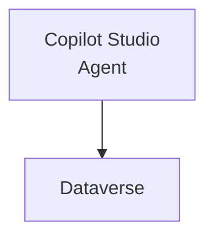

# Brand Voice Rules (Cowork)

These four rules govern every `readme.md` and guide under `demos/` and `labs/`.
They override any looser guidance elsewhere.

## Rule 1: No em dashes in prose

Em dashes (`—`) and spaced en dashes used as em dashes are banned in prose.
Replace with the punctuation that fits the sentence:

- A comma for a light pause: `agents, copilots, and plugins`.
- A colon to introduce: `one goal: automate the workflow`.
- A semicolon to join clauses: `build it once; reuse it everywhere`.
- Parentheses for an aside: `Copilot Cowork (the agentic experience)`.

Hyphens in compound words (`low-code`, `human-in-the-loop`, `pro-code`) are fine.

## Rule 2: Quoted Mermaid labels

Mermaid node labels must use `"quoted labels"` for line breaks, never `\n`.

Correct:

Wrong:

Keep diagrams readable: quote any label containing spaces or special characters.

## Rule 3: Four-sentence paragraph cap

No paragraph exceeds four sentences. At the fifth sentence, start a new
paragraph. This keeps module intros scannable for the workshop audience (Power
Platform Makers, Software Engineers, Solution Architects).

## Rule 4: Topic-specific slash-command tables

A module's slash-command table lists only commands relevant to that module's
topic. Never repeat the same generic table across modules.

- `/init` appears only in modules about project setup.
- A Copilot Studio module lists Copilot Studio and Power Platform commands, not
  MCP or connector commands from other modules.
- If a module has no topic-specific commands, omit the table rather than pad it.

## Cross-cutting conventions

These support the four rules and apply everywhere:

- Code fences must declare a language (`bash`, `json`, `csharp`, `mermaid`, ...).
- Internal links use relative paths (e.g. `demos/01-intro/readme.md`); anchors
  use `#heading-name`.
- Fix violations with minimal diffs. Do not rewrite a passing section.
