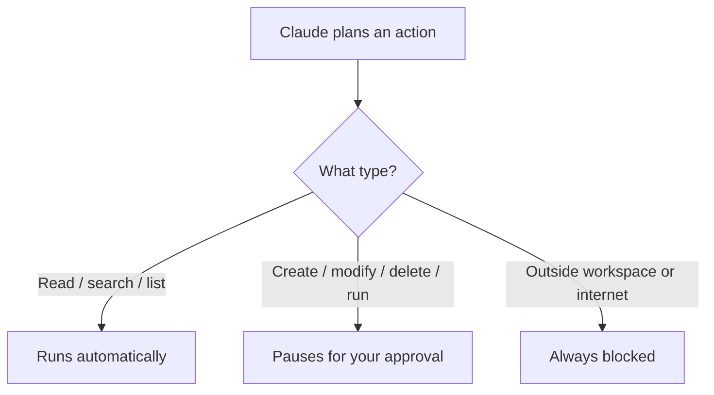

# Create Slides

Turn one or more topic `readme.md` files into presentation slides. There are two
first-class paths, chosen per class, and this skill picks or asks which one to use.

- **Gamma path**: analyse a topic readme and write structured slide spec files into the
  module's `pptx/` folder, ready for Gamma AI to generate the deck. The `merge-slides`
  sub-capability lives under this path.
- **PPTX path**: generate a local `.pptx` deck directly with python-pptx (via the `pptx`
  skill), for classes that do not use Gamma.

Not every class uses Gamma, so neither path is a fallback for the other; both are
first-class and equally supported.

## Choosing the path

| Choose | When |
|--------|------|
| Gamma path | The class uses Gamma; the request mentions "gamma slides", "slide spec", "topic to slides"; the module already holds `pptx/*.md` spec files; you want editable AI-generated design |
| PPTX path | The class does not use Gamma; the request mentions "pptx deck", "generate deck", "local deck", "python-pptx"; you need a finished `.pptx` on disk with no external service |

If the request does not make the path obvious and the module gives no signal (no existing
spec files, no stated Gamma preference), ask which path before generating anything.

## Inputs (both paths)

The target path is a topic folder or a module root:

- A **topic folder**: `demos/03-cowork/03-permissions` processes that single readme.
- A **module root**: `demos/03-cowork` processes all numbered topic subfolders in order.

If no path is given, ask for one before proceeding. Derive the **module root** (the
`demos/NN-*` segment) and the **output folder** `{module-root}/pptx/` from the path.

---

## Gamma path

Analyse each topic readme and write structured slide spec files into the module's `pptx/`
folder, ready for Gamma AI presentation generation.

### 1. Resolve the target

If the path ends with a numbered topic folder (matches `[0-9][0-9]-*`): collect only that
folder's `readme.md`. If the path is a module root: use Glob to find all
`[0-9][0-9]-*/readme.md` children directly under it, and process each in numeric order.

### 2. Read each readme

For each topic readme, extract the H1 title and all H2 section headings, every Mermaid
code block, the `## In Practice` section if present, and any short JSON or code blocks.
Note the topic folder name (e.g. `03-permissions`) and its numeric prefix (e.g. `03`).

### 3. Plan the slide set

Target **3 to 6 slides per topic**. Do not create one slide per section heading.

| Slide type | When to create | Layout |
|---|---|---|
| Section intro | Always: one per topic, opens the set | `title-only` |
| Core concept | One or two headline ideas worth standalone treatment | `content` |
| Diagram | When a Mermaid block exists and adds visual clarity | `diagram` or `mixed` |
| Practical example | When an `## In Practice` section exists | `content` or `quote` |
| Code or config | When a short JSON/code block is the point | `mixed` |

- `title-only`: 2 to 3 orientation bullets, atmospheric background visual
- `content`: 3 to 5 tight bullets, small accent icon
- `diagram`: equal split, Mermaid on one side, bullets on the other
- `mixed`: 2 to 3 bullets beside a code block or annotated image
- `quote`: one impactful sentence centred, photo overlay behind it

Skip a section if it adds no standalone teachable moment beyond adjacent slides.

### 4. Write slide files

**File name:** `{topic-nr}-{order:02d}-{slug}.md`

- `topic-nr`: numeric prefix of the source topic (e.g. `03`)
- `order`: zero-padded position within the topic (01, 02, ...)
- `slug`: 2 to 3 word lowercase hyphen slug from the slide title

**File format:**

````markdown
---
slide: "{topic-nr}-{order:02d}"
topic: {topic-folder-name}
title: "{Slide Title}"
subtitle: "{One-line subtitle, omit if none}"
layout: {title-only|content|diagram|mixed|quote}
visual-weight: {see table below}
visual-type: {none|mermaid|icon|photo|code}
visual-prompt: >
  {Required when visual-type is photo or mermaid; omit otherwise.
  Photo: text-to-image prompt for Midjourney/DALL-E/Firefly, covering subject, mood,
  lighting, composition, style. No text, logos, or UI in the image.
  Mermaid: plain-language diagram description covering node labels, flow direction,
  colour intent, and what concept it illustrates.}
photo-link: "{relative path e.g. assets/images/foo.jpg, omit if no asset exists}"
order: {numeric}
source: {relative path to source readme}
gamma_prompt: >
  {Self-contained Gamma generation prompt. One paragraph. Describe slide purpose,
  content, and visual clearly. No references to external context. Include colour
  intent, layout preference, and diagram type where relevant.}
---

# {Slide Title}

## Content

{Bullets or one-liners. Max 5 items. Bold one key term per bullet where natural.
Present for every layout without exception.}

## Diagram

```mermaid
{Mermaid block, only present when visual-type is mermaid.}
```

## Notes

{1 to 2 presenter sentences: analogy to use, what to emphasise, what to skip under
time pressure. Always present.}
````

**visual-weight values:**

| Value | Proportion | Use when |
|---|---|---|
| `none` | Text only | Dense concept or bullet slides |
| `1/3` | Small accent | Icon or tiny diagram alongside text |
| `1/2` | Equal split | Mermaid diagram, side-by-side comparison |
| `2/3` | Visual dominant | Strong diagram, annotated screenshot |
| `full` | Visual IS the slide | Minimal text, image speaks for itself |
| `bg` | Subtle background | Atmospheric opener, mood-setting |
| `grid` | 2 to 4 small visuals | Three concepts, icon-per-point rows |
| `strip` | Thin top or bottom band | Wide timelines, step sequences |
| `overlay` | Photo with frosted text layer | Quotes, closing slides, dramatic statements |

### 5. Field rules

- No em dashes in any field. Use `,` `;` `:` or `()` instead.
- `title` and `subtitle`: sentence case, no trailing period.
- `gamma_prompt`: self-contained, no phrases like "as described above" or "see source".
- `visual-prompt`: required when `visual-type` is `photo` or `mermaid`; omit for all other types.
- `photo-link`: optional. When both `photo-link` and `visual-prompt` are present, `photo-link` is the preferred asset and `visual-prompt` is the fallback generation instruction.
- `## Diagram` section: present only when `visual-type` is `mermaid`.
- `## Content` section: present for every layout without exception.
- Mermaid node labels use `"quoted<br/>labels"`, never `\n`.
- `# {Slide Title}` heading: present in every file, matches the `title` frontmatter field exactly.

### 6. Print summary

```text
CREATED: demos/03-cowork/pptx/03-01-permissions-intro.md  [title-only]
CREATED: demos/03-cowork/pptx/03-02-three-tiers.md        [diagram]
CREATED: demos/03-cowork/pptx/03-03-approval-prompts.md   [content]
CREATED: demos/03-cowork/pptx/03-04-allow-list.md         [mixed]
CREATED: demos/03-cowork/pptx/03-05-in-practice.md        [quote]

SUMMARY: 5 slides written for 03-permissions -> demos/03-cowork/pptx/
```

If a topic produced more than 10 spec files, flag the Gamma 10-item cap here and offer the
merge-slides sub-capability (below).

### Example output file

`demos/03-cowork/pptx/03-02-three-tiers.md`:

````markdown
---
slide: "03-02"
topic: 03-permissions
title: "Three types of action"
subtitle: "How Claude classifies everything it might do"
layout: diagram
visual-weight: 1/2
visual-type: mermaid
visual-prompt: >
  Top-down flowchart. Entry node "Claude plans an action" connects to a diamond
  "What type?". Three branches: left labelled "Read / search / list" to a green
  rounded rectangle "Runs automatically"; centre labelled "Create / modify / delete /
  run" to an amber rounded rectangle "Pauses for your approval"; right labelled
  "Outside workspace or internet" to a red rounded rectangle "Always blocked".
  White background, clean sans-serif font, no drop shadows.
order: 2
source: demos/03-cowork/03-permissions/readme.md
gamma_prompt: >
  Slide titled "Three types of action", subtitle "How Claude classifies everything
  it might do". Left half contains three short bullet points. Right half shows a
  top-down decision flowchart with three colour-coded outcome branches: green for
  auto-allowed, amber for approval-required, red for always-blocked. Clean minimal
  style, white background.
---

# Three types of action

## Content

- Every action Claude plans falls into one of three categories
- **Auto-allowed**: read, search, list files, no prompt, no pause
- **Approval required**: create, modify, delete, or run a command
- **Always blocked**: outside the workspace, internet access

## Diagram



## Notes

Use the signing-authority analogy: like employee approval levels in any company.
Green, amber, red maps directly to the colour convention audiences already know.
````

### Sub-capability: merge-slides

**Gamma caps at ~10 items per generation call.** When a module produces more than 10 slide
spec files, the user generates multiple PPTX exports from Gamma and then merges them into
one deck. Invoke [references/merge-slides.md](references/merge-slides.md) when:

- The user asks to merge PPTX files after Gamma export
- A module has more than 10 slide spec files (flag this proactively after step 4)
- The user says "combine the parts", "merge the pptx", or similar

That reference holds a self-contained Python script and a verification step. Read it and run
the merge inline; do not ask the user to run it manually.

---

## PPTX path

Generate a local `.pptx` deck directly, with no Gamma involved. Use this for classes that do
not use Gamma or when the request asks for a finished `.pptx` on disk.

### 1. Read the source

Read the same inputs as the Gamma path (H1 title, H2 headings, Mermaid blocks, `## In
Practice`, short code/JSON blocks). Plan **5 to 8 slides** per deck using the same slide-type
planning table from the Gamma path.

### 2. Prefer the pptx skill

If a `pptx` skill is available in this environment, use it: it carries design guidance
(palette, typography, layout, QA loop) and helper scripts (`scripts/thumbnail.py` for a
visual overview, `scripts/office/soffice.py` plus `pdftoppm` for rendering slides to images,
`markitdown` for text extraction). Follow its create-from-scratch and QA workflow.

If no `pptx` skill is available, generate the deck with python-pptx directly:

- Verify the library imports first: `python -c "import pptx"`.
- Write a generation script, run it, then delete the script.
- Use real slide layouts with title and content placeholders.
- No inline comments or placeholder text in the script.

### 3. Design and content rules

- One title slide, then content slides, then a closing slide.
- Every slide carries a visual element (icon, shape, chart, or image); avoid plain title
  plus bullets.
- Left-align body text; centre only titles.
- Pick a topic-informed palette; do not default to generic blue.
- No em dashes in slide text. Use `,` `;` `:` or `()`.
- Render a Mermaid diagram to an image first if a slide needs one; python-pptx does not
  render Mermaid natively.

### 4. QA before done

Extract and inspect the result: `python -m markitdown deck.pptx` for content, and render to
images to catch overlap, overflow, and low-contrast issues. Fix, then re-verify the affected
slides. Do not declare success until one full fix-and-verify cycle passes clean.

### 5. Output

Write the deck to `{module-root}/pptx/{module-name}.pptx` and print a one-line summary with
the slide count and path.

---

## Cross-cutting rules

- No em dashes in prose or slide fields. Use `,` `;` `:` or `()`.
- Code fences declare a language.
- Mermaid node labels use `"quoted<br/>labels"`, never `\n`.
- Internal links use relative paths; anchors use `#heading-name`.
- Never overwrite an existing spec file or deck silently; skip and report instead.
- Parallelize independent work (reading multiple readmes, writing multiple spec files).
