# Mermaid Implementation Playbook

Practical syntax reference and examples for each supported diagram type.

---

## Choosing the Right Diagram Type

| Need | Use |
|---|---|
| Process flow / decision tree | `flowchart` |
| System/API interactions over time | `sequenceDiagram` |
| Data structure / object model | `classDiagram` or `erDiagram` |
| State transitions | `stateDiagram-v2` |
| Scheduling / milestones | `gantt` |
| User experience flow | `journey` |
| Proportional data | `pie` |
| Git branching strategy | `gitGraph` |
| 2×2 comparison | `quadrantChart` |
| Chronological events | `timeline` |

---

## flowchart

Use for process flows, decision trees, and pipelines.

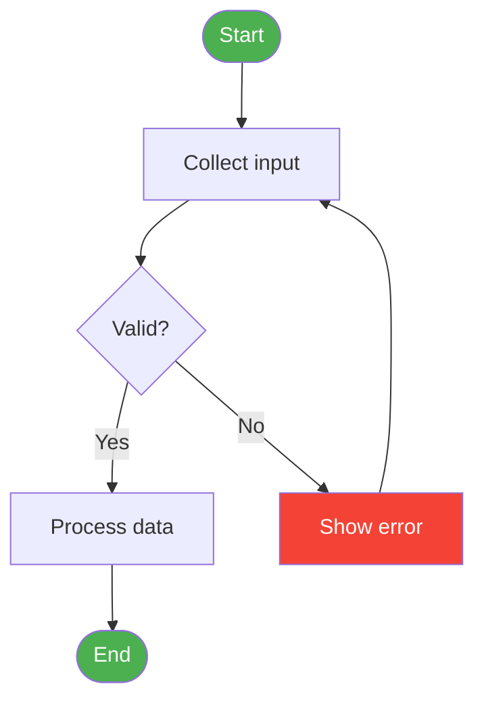

**Key syntax:**
- `TD` = top-down, `LR` = left-right
- `[]` rectangle, `{}` diamond, `()` rounded, `([])` stadium, `[/\]` trapezoid
- `-- label -->` labelled edge, `-.->` dashed, `==>` thick

---

## sequenceDiagram

Use for API calls, authentication flows, and service interactions.

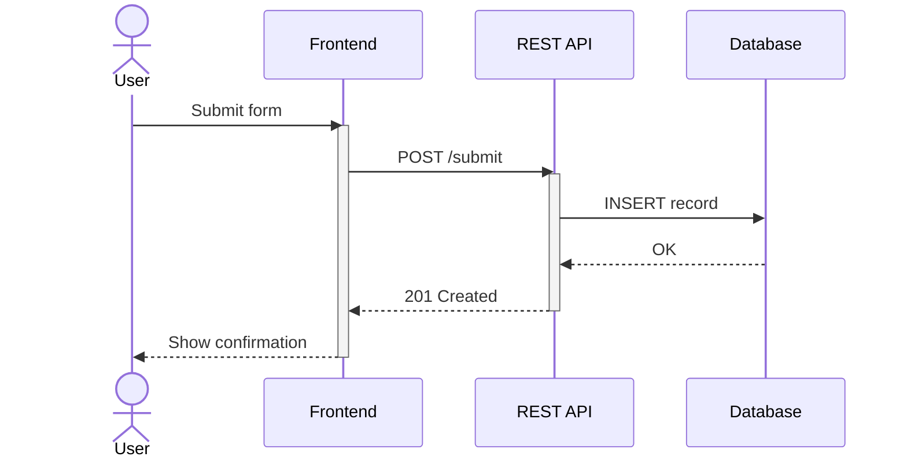

**Key syntax:**
- `->>` solid arrow, `-->>` dashed reply
- `activate` / `deactivate` for lifeline boxes
- `actor` for human participants
- `Note over A,B: text` for annotations
- `loop`, `alt`, `opt`, `par` for control blocks

---

## classDiagram

Use for object models, domain models, and interface contracts.

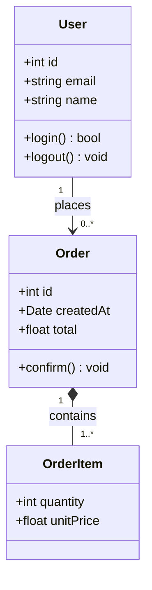

**Key syntax:**
- `+` public, `-` private, `#` protected
- `<|--` inheritance, `*--` composition, `o--` aggregation, `-->` association
- `<<interface>>`, `<<abstract>>` stereotypes

---

## erDiagram

Use for database schemas and entity relationships.

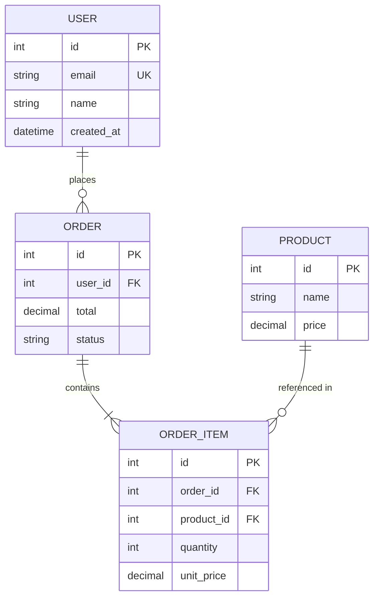

**Key syntax:**
- `||--||` one-to-one, `||--o{` one-to-many, `}o--o{` many-to-many
- `PK`, `FK`, `UK` column constraints

---

## stateDiagram-v2

Use for lifecycle states, workflow steps, and mode transitions.

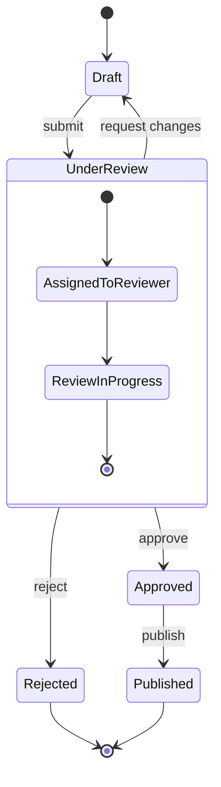

**Key syntax:**
- `[*]` entry/exit pseudo-state
- Nested states with `state Name { ... }`
- `--` for concurrent (fork) states

---

## gantt

Use for project timelines, sprints, and release schedules.

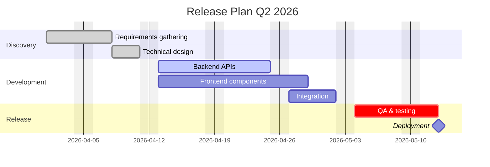

**Key syntax:**
- `done`, `active`, `crit` status modifiers
- `after <id>` for sequencing
- `milestone` for zero-duration milestone markers
- `dateFormat` controls input date parsing

---

## journey

Use for user experience flows and customer journeys.

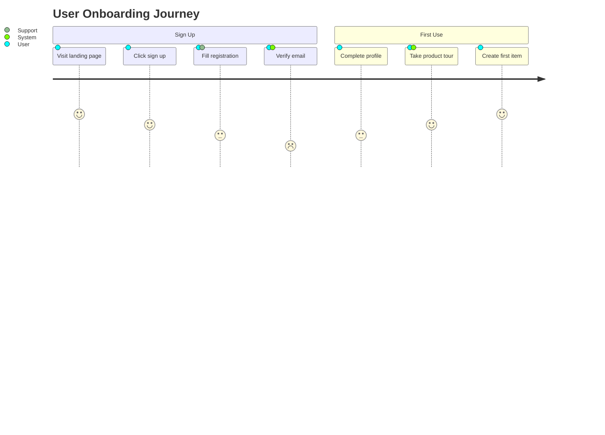

**Key syntax:**
- Score 1–5 (1 = worst, 5 = best)
- Multiple actors per step separated by `,`

---

## pie

Use for proportional data and distribution breakdowns.

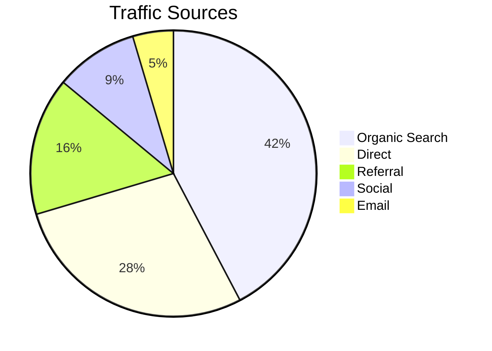

---

## gitGraph

Use for branching strategies and release models.

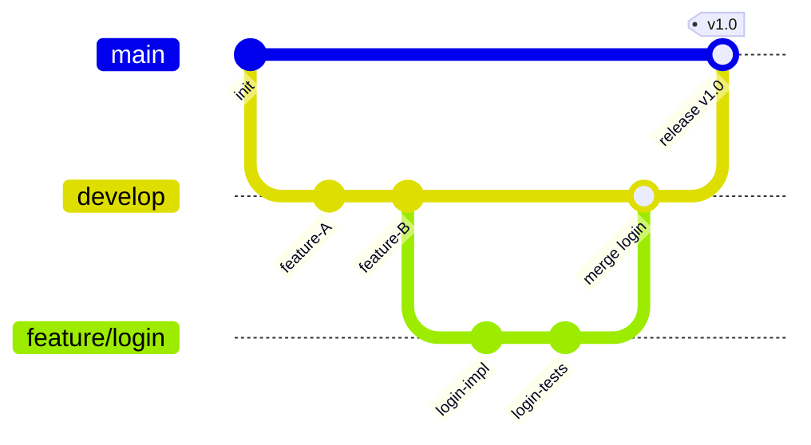

---

## quadrantChart

Use for 2×2 prioritization matrices (effort/value, risk/impact).

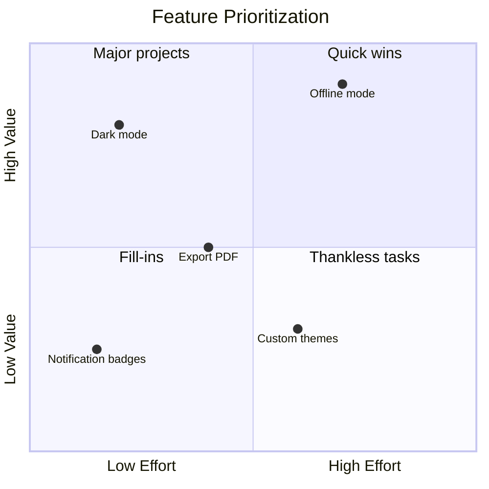

---

## timeline

Use for historical events, product history, and roadmaps.

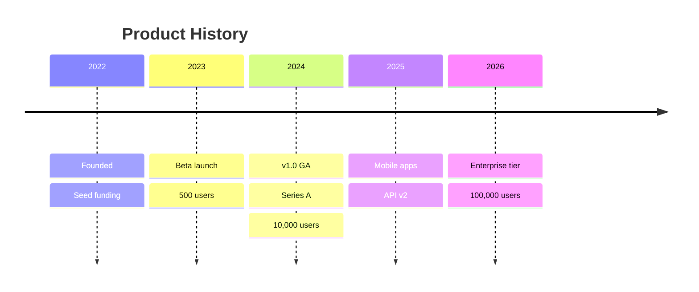

---

## Styling Reference

### Node colors (flowchart)
```
style NodeId fill:#hexcolor,stroke:#hexcolor,color:#hexcolor
```

### Class-based styling (flowchart)
```
classDef primary fill:#1976D2,stroke:#0D47A1,color:#fff
class A,B primary
```

### Theme variables (all diagrams)
```
%%{init: {'theme': 'base', 'themeVariables': {
    'primaryColor': '#1976D2',
    'primaryTextColor': '#fff',
    'primaryBorderColor': '#0D47A1',
    'lineColor': '#555',
    'background': '#fff'
}}}%%
```

### Available themes
- `default` — light, neutral
- `base` — minimal, fully customizable
- `dark` — dark background
- `forest` — green tones
- `neutral` — muted grays

---

## Common Pitfalls

| Problem | Fix |
|---|---|
| Diagram doesn't render | Check for unclosed brackets or missing `end` |
| Labels with special chars break syntax | Wrap in `"quotes"` |
| Arrow labels not showing | Use `-- label -->` not `--label>` |
| ERD cardinality wrong side | Check `\|\|` vs `o\|` direction matches intent |
| Gantt dates not parsing | Verify `dateFormat` matches your date strings |
| Long node labels overflow | Shorten label or use `<br/>` for line break |
