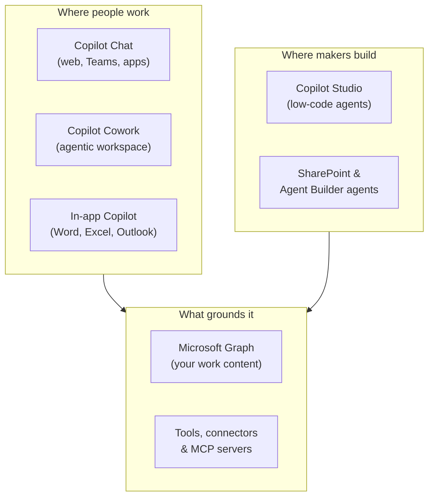

# Agents & Copilots for Microsoft 365

This topic sets the vocabulary for the whole course. Before you build anything, you need a clear mental model of what a copilot is, what an agent is, and how both fit into the Microsoft 365 platform you already use. By the end you can place any product you meet later (Copilot Chat, Copilot Studio, Cowork, SharePoint agents) on a single map and explain what job it does.

---

## Copilot, Agent, Assistant: One Vocabulary

These words get used loosely, so this course fixes their meaning up front.

| Term | What it is | Who drives |
|---|---|---|
| Copilot | An AI assistant embedded in an app or surface you already use, grounded in your work content | The human asks; Copilot responds turn by turn |
| Agent | A copilot given a specific job, its own knowledge, instructions, and tools it can call | The human sets a goal; the agent plans and acts across steps |
| Assistant | The general category: any AI that helps a person complete work in natural language | Either, depending on capability |

A useful way to hold it: every agent is a copilot with a narrower job and more autonomy. Microsoft 365 Copilot is the broad assistant across your apps. An agent you build in Copilot Studio is a focused copilot for one process, for example handling sales objections or answering HR policy questions.

---

## The Microsoft 365 Copilot Ecosystem

Copilot is not one product, it is a layer that spans the platform. The pieces you will meet in this course sit at different levels, from the everyday chat experience up to the pro-code extensibility surface.

The experiences layer is what end users touch. The build layer is where makers and developers assemble agents. Both stand on a shared foundation: Microsoft Graph, which grounds Copilot in your emails, files, chats, and meetings, and the tools and connectors that let agents reach beyond Graph into other systems.

---

## From Copilot to Agent

The step up from a copilot to an agent is autonomy: instead of answering one turn, an agent takes a goal and works a sequence of steps to reach it. An agent is a copilot given a goal, the tools to pursue it, and a loop to keep going until it is met.

That shift, the three properties behind it, and the design patterns teams use to structure it are the subject of the [next topic on Agentic AI](../02-agentic-ai/readme.md). Here it is enough to place agents on the map above; the mechanics come next.

---

## Where Agents Live in Microsoft 365

The same agent concept shows up in several places, each suited to a different builder and audience.

| Surface | Best for | Who builds it |
|---|---|---|
| Copilot Chat | Everyday drafting, summarizing, and Q&A | Everyone, no build required |
| Copilot Cowork | Recurring knowledge-work automation with skills | Business users, low-code |
| Agent Builder / SharePoint agents | Site-grounded and prebuilt agents | Makers, no code |
| Copilot Studio | Custom agents with topics, tools, and orchestration | Low-code makers, pro-code |

You do not have to choose one path forever. A common pattern is to prototype in a no-code surface, then rebuild in Copilot Studio when the process needs custom tools, multi-agent orchestration, or governance.

---

## Practical Scenarios

| Scenario | Copilot vs. Agent |
|---|---|
| "Summarize this thread" | Copilot Chat, one turn |
| "Every Monday, compile my team's highlights and post them" | Agent (scheduled, multi-step) |
| "Answer customer objections using our approved playbook" | Agent (grounded knowledge plus instructions) |
| "Draft a reply using the latest numbers in this file" | Copilot Chat, grounded in Graph |

The dividing line is scope and autonomy. When a task repeats, spans steps, or needs its own knowledge and tools, it is agent work.

---

## Where to Go Next

1. [Agentic AI & Design Patterns](../02-agentic-ai/readme.md): the goal-driven model and the patterns you will build with
2. [How Agents Work: Knowledge, Prompting, Tools & MCP](../03-agent-anatomy/readme.md): the parts every agent is made of
3. [Extensibility & Development Paths](../04-extensibility/readme.md): how to choose where to build

---

## Links & Resources

- [Microsoft 365 Copilot overview](https://learn.microsoft.com/microsoft-365/copilot/microsoft-365-copilot-overview)
- [What are agents in Microsoft 365 Copilot](https://learn.microsoft.com/microsoft-365-copilot/extensibility/agents-overview)
- [Microsoft 365 Copilot extensibility overview](https://learn.microsoft.com/microsoft-365-copilot/extensibility/)
- [Microsoft Copilot Scenario Library](https://adoption.microsoft.com/en-us/scenario-library/)
