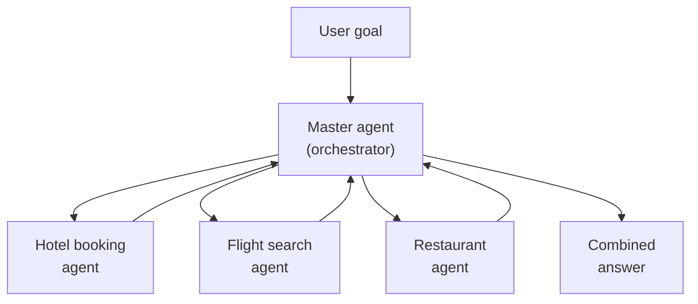

# Agentic AI & Design Patterns

The last topic gave you the vocabulary; this one explains the idea that makes agents worth building. Agentic AI is the shift from a system that answers a question to one that pursues a goal: it plans, calls tools, checks its own work, and keeps going until the job is done. Understanding this shift, and the handful of patterns teams use to structure it, is what lets you tell a genuine agent scenario from a plain chatbot request. Get this right and you will pick the correct design before you open any builder.

---

## What Makes an AI Agentic

A plain chatbot answers one turn at a time and forgets. An agent takes a goal, breaks it into steps, and works the steps until the outcome is reached. The move is from "answer my question" to "get this done for me."

Three properties separate an agent from a chatbot.

- Goal-driven: it works toward an outcome you describe, not a single reply.
- Tool-using: it calls functions, searches knowledge, reads data, and acts in other systems.
- Iterative: it loops (plan, act, observe, adjust) instead of answering once.

You stay in control through human-in-the-loop approvals: the agent proposes an action such as sending an email or updating a record, and a person approves before it runs. This control theme runs through Cowork and Copilot Studio for the rest of the course.

---

## Business Process: Before and After Agents

The clearest way to see the value is to compare an everyday process run by hand versus run with an agent. A quarterly account review today means a person gathering files, reading emails, checking a CRM, and assembling a summary across an afternoon. The same review with an agent becomes a goal you hand off, with the person reviewing and approving the result.

| | Process today | Process with agentic AI |
|---|---|---|
| Who does the steps | A person, manually | An agent, with the person approving |
| Data gathering | Open each system by hand | Agent calls tools and knowledge |
| Consistency | Varies by who runs it | Same instructions every run |
| Time to result | Hours | Minutes, plus a review |
| Human role | Does the work | Sets the goal and approves |

The person does not leave the loop; their job moves from doing every step to defining the goal and judging the output. That is the outcome you are designing toward whenever you build an agent in this course.

---

## Capabilities of an Agent

Every agentic capability rests on the three-part model you will meet in detail in the next topic: instructions, knowledge, and tools. Agentic behaviour is what emerges when those parts run inside a loop.

| Capability | What it enables |
|---|---|
| Planning | Break a goal into an ordered set of steps |
| Tool calling | Fetch live data or take action in other systems |
| Grounding | Answer from your content instead of guessing |
| Memory | Carry context across the steps of a task |
| Reflection | Check a result and retry when it falls short |
| Approval gates | Pause for a human before a consequential action |

A weak agent is usually missing depth in one of these, and naming which one is the fastest route to a fix.

---

## Design Patterns in Agentic AI

Most agent solutions are assembled from a small set of recurring patterns. You choose a pattern for the shape of the problem, not by habit, and you can combine them in one solution.

| Pattern | When to use it |
|---|---|
| Single agent | One job, one set of instructions, knowledge, and tools |
| Multi-agent orchestration | A master agent routes work to focused specialists |
| Deterministic flow | The steps are fixed and must run the same way every time |
| Autonomous agent | A trigger fires the agent to act without a person starting it |
| Human-in-the-loop | A person approves before the agent takes a consequential action |

Deterministic flows and autonomous agents are covered in the advanced module; single-agent and multi-agent design start in Copilot Studio Basics. This topic gives you the map so those later choices are deliberate.

---

## Multi-Agent Systems

When one agent would carry too many jobs, you split the work: a master agent owns the goal and routes each request to a specialist that owns one domain. Each specialist has its own instructions, knowledge, and tools, so it stays small and easy to maintain. The master handles orchestration, deciding which specialist answers and combining their results.

This design gives you specialized expertise per agent, integrated tools and knowledge across the system, and modular pieces that are easier to reuse and expand. The trade-off is orchestration: the master needs clear routing rules so the right specialist handles each request. You build exactly this in the advanced module as focused and connected agents.

---

## Where to Go Next

1. [How Agents Work: Knowledge, Prompting, Tools & MCP](../03-agent-anatomy/readme.md): the three parts every agent is assembled from
2. [Extensibility & Development Paths](../04-extensibility/readme.md): how to choose where to build a pattern
3. [Agents & Copilots for Microsoft 365](../01-agents-copilots/readme.md): revisit the vocabulary this topic builds on

---

## Links & Resources

- [What are agents in Microsoft 365 Copilot](https://learn.microsoft.com/microsoft-365-copilot/extensibility/agents-overview)
- [Multi-agent orchestration in Copilot Studio](https://learn.microsoft.com/microsoft-copilot-studio/advanced-multiagent)
- [Microsoft Copilot Scenario Library](https://adoption.microsoft.com/en-us/scenario-library/)
