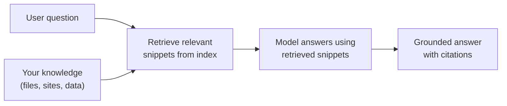

# How Agents Work: Knowledge, Prompting, Tools & MCP

Every agent you build in this course, no matter the surface, is assembled from the same three parts: instructions that shape its behaviour, knowledge it can draw on, and tools it can call to act. This topic explains those parts and the retrieval machinery (semantic index and RAG) that lets an agent answer from your content instead of guessing. Get this model right and everything later in the course clicks into place.

---

## The Three Parts of Every Agent

| Part | What it does | Example |
|---|---|---|
| Instructions | The system prompt that sets the agent's role, tone, and rules | "You are a sales assistant. Answer only from the approved playbook." |
| Knowledge | Grounding content the agent retrieves from to answer accurately | SharePoint sites, uploaded files, Dataverse tables, Bing custom search |
| Tools | Functions the agent calls to fetch live data or take action | A REST connector, an MCP server, a Power Automate flow |

Instructions decide how the agent behaves. Knowledge decides what it knows. Tools decide what it can do. A weak agent is almost always missing depth in one of the three, and the fix is to name which one.

---

## Prompt Engineering: Shaping Behaviour

The instructions you write are the single biggest lever on quality. Good agent instructions are specific about role, scope, and refusal behaviour, not just a friendly greeting.

A dependable structure for agent instructions:

```text
Role: who the agent is and its single job.
Scope: what it should and should not handle.
Grounding: which knowledge to trust, and to say "I don't know" when it is missing.
Tone: how to sound (concise, formal, empathetic).
Steps: the order to work in for multi-step tasks.
```

Two habits raise quality fast. Tell the agent to ground its answers in the provided knowledge and to admit when the answer is not there, which cuts down confident wrong answers. Give one or two worked examples of a good response, so the model matches a pattern rather than inventing a format.

---

## Semantic Index & RAG: Answering From Your Content

A language model on its own only knows its training data, which is generic and frozen in time. Retrieval Augmented Generation (RAG) fixes this by fetching relevant snippets from your content at question time and handing them to the model as context, so the answer is grounded in your documents rather than the model's memory.

The semantic index is what makes retrieval find the right snippets. It stores your content as embeddings (numeric representations of meaning), so a search for "time off policy" also matches a document titled "annual leave," because the two are close in meaning, not just in words.



The payoff is accuracy plus traceability. Because the answer is built from named sources, Copilot can cite them, and you can trust (and audit) where a claim came from. In Microsoft 365, the Semantic Index for Copilot builds this map over your Graph content automatically, so licensed Copilot answers are grounded in your work by default.

---

## Tools & Model Context Protocol (MCP)

Knowledge lets an agent read. Tools let it act and reach live systems: check an order status, create a ticket, query a database, or call an internal API. Without tools an agent is limited to what it was given up front; with tools it can pull fresh data and change the world.

The Model Context Protocol (MCP) is an open standard for exposing tools to any AI agent. Instead of writing a bespoke integration for each product, you run an MCP server that describes its tools once, and any MCP-aware agent (Copilot Studio, Claude, and others) can discover and call them.

| Without MCP | With MCP |
|---|---|
| A custom connector per agent platform | One server, many agents |
| Tool definitions duplicated everywhere | Tools described once, discovered at runtime |
| Tight coupling to one vendor | Portable across AI platforms |

MCP matters because it makes your integrations portable. A tool you expose today for a Copilot Studio agent works tomorrow for a different agent host without a rewrite. You will build and consume MCP servers later in the course; here the point is where they sit, as the tool layer every agent shares.

---

## Putting the Parts Together

A well-built agent reads its instructions, retrieves grounding from knowledge when it needs facts, and calls tools when it needs live data or has to act. Diagnosing a weak agent means asking which part is thin.

| Symptom | Likely missing part |
|---|---|
| Confident but wrong answers | Knowledge (no grounding) or instructions (no "say I don't know") |
| Off-topic or wrong tone | Instructions (weak role and scope) |
| Cannot see current data or take action | Tools (no connector or MCP server) |
| Ignores your documents | Knowledge not indexed, or not referenced in instructions |

---

## Where to Go Next

1. [Extensibility & Development Paths](../04-extensibility/readme.md): where to build agents like these
2. [Agents & Copilots for Microsoft 365](../01-agents-copilots/readme.md): revisit the vocabulary these parts assemble into

---

## Links & Resources

- [Retrieval Augmented Generation (RAG) explained](https://learn.microsoft.com/azure/ai-studio/concepts/retrieval-augmented-generation)
- [Semantic Index for Microsoft 365 Copilot](https://learn.microsoft.com/microsoftsearch/semantic-index-for-copilot)
- [Model Context Protocol](https://modelcontextprotocol.io/)
- [Add knowledge to Copilot Studio agents](https://learn.microsoft.com/microsoft-copilot-studio/knowledge-add-file-upload)
- [Write effective agent instructions](https://learn.microsoft.com/microsoft-copilot-studio/authoring-generative-mode-instructions)
