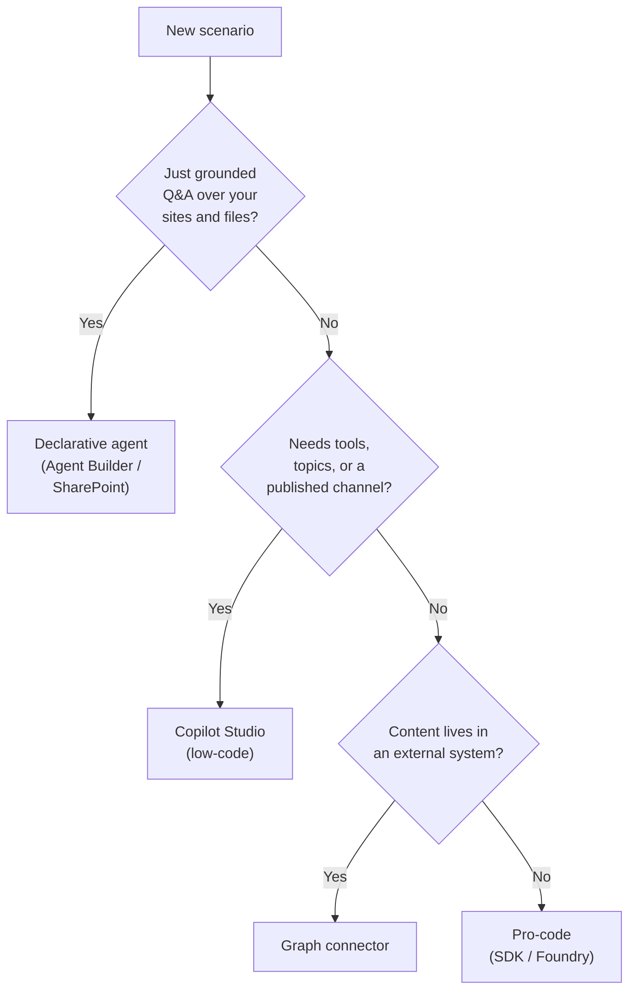

# Extensibility & Development Paths

Microsoft gives you several ways to extend Copilot, from no-code declarative agents to full pro-code engines, and picking the right one is a design decision, not a coincidence. This topic explains the extensibility surface, gives you a decision framework for choosing a path, and shows how to envision a scenario before you build. The goal is that you never start building in the wrong tool.

---

## Why Extensibility Exists

Out of the box, Microsoft 365 Copilot answers from the web and (with a license) your Graph content. That covers a lot, but it does not know your custom systems, your line-of-business data, or your specific processes. Extensibility is how you close that gap: you add knowledge, connect tools, and shape behaviour so Copilot works on your organisation's terms.

There are two broad ways to extend Copilot, and they answer different questions.

- Ground Copilot in more of your content, so it can answer from systems it could not see before (connectors, knowledge sources).
- Build a focused agent with its own instructions, knowledge, and tools, so it handles a specific job end to end (Agent Builder, Copilot Studio, pro-code).

---

## The Extensibility Paths

The paths trade ease of building against control and capability. No-code is fastest to ship; pro-code gives you the most power and the steepest effort.

| Path | Build effort | You get | Best when |
|---|---|---|---|
| Declarative agents (Agent Builder, SharePoint) | Lowest, no code | Instructions plus knowledge, on top of the Copilot model | A grounded Q&A or task assistant over your sites and files |
| Copilot Studio (low-code) | Low to medium | Topics, tools, orchestration, channels, governance | A custom process agent that calls tools and publishes to Teams or web |
| Graph connectors | Medium | External content indexed into Microsoft Graph | You need Copilot to answer from a system outside M365 |
| Pro-code (Agents SDK, Azure AI Foundry) | Highest | Full control over the agent runtime and model | Complex orchestration, custom hosting, deep integration |

Most of this course lives in the Copilot Studio low-code path, because it hits the best balance of speed and control for the maker and architect audience. You will still meet the declarative and pro-code ends so you know when to reach for them.

---

## Choosing a Path: A Decision Framework

Run a candidate scenario through these questions in order, and stop at the first path that fits.

The bias should be toward the lowest-effort path that meets the need, then move up only when a real requirement forces it. Over-engineering a simple Q&A into a pro-code project wastes time; under-building a tool-heavy process in a declarative agent hits a wall. Naming the requirement that forces the jump (a tool call, a channel, external data) keeps the choice honest.

---

## Envisioning: Scope Before You Build

The most expensive mistake is building the wrong thing well. Envisioning is a short, structured pass that turns a vague wish ("we want an AI for support") into a scoped, buildable agent before any configuration starts.

A lightweight envisioning canvas for one agent:

| Question | Example answer |
|---|---|
| Who is the user? | Frontline support reps |
| What outcome? | Resolve tier-1 tickets without escalating |
| What knowledge? | Product docs, known-issues list, refund policy |
| What tools/actions? | Look up order status, create a ticket |
| What must a human approve? | Refunds over a threshold |
| How do we know it works? | First-contact resolution rate, CSAT |

Fill this in with a stakeholder before you open Copilot Studio. It tells you the path (this one clearly needs tools, so Copilot Studio), the knowledge to gather, and the success measure you will evaluate against later in the course.

---

## From Scenario to Capability

Envisioning names the outcome; the next move is mapping each need to a concrete Microsoft capability. This mapping is the bridge from idea to build.

| Scenario need | Maps to |
|---|---|
| Answer from our policy documents | Knowledge source (files or SharePoint) |
| Look up a live order status | Tool (REST connector or MCP server) |
| Approve refunds before they run | Human-in-the-loop approval |
| Reach users in Teams | Channel (publish to Teams) |
| Prove it works before go-live | Agent evaluations and test sets |

You will do this end to end in the final module on designing business processes. Here the point is the habit: envision, map, then build, in that order.

---

## Where to Go Next

1. [Licensing & Environment Setup](../04-licensing-setup/readme.md): enable and configure what your chosen path needs
2. [How Agents Work: Knowledge, Prompting & Tools](../02-agent-anatomy/readme.md): the parts you will assemble on any path

---

## Links & Resources

- [Microsoft 365 Copilot extensibility overview](https://learn.microsoft.com/microsoft-365-copilot/extensibility/)
- [Choose your extensibility path](https://learn.microsoft.com/microsoft-365-copilot/extensibility/decision-guide)
- [Agents and Microsoft 365 Copilot extensibility](https://learn.microsoft.com/microsoft-365-copilot/extensibility/overview-agents-and-copilots)
- [Microsoft Graph connectors overview](https://learn.microsoft.com/microsoftsearch/connectors-overview)
- [Microsoft Copilot Scenario Library](https://adoption.microsoft.com/en-us/scenario-library/)
