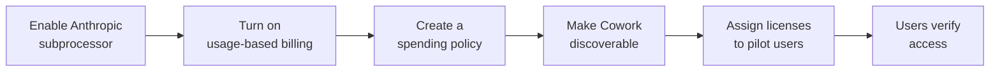

# Microsoft 365 Copilot Cowork

> **Availability**: Cowork is now generally available. Access is governed by usage-based billing (Copilot Credits), not by Frontier enrollment; see [Setting Up Cowork in Your Tenant](#setting-up-cowork-in-your-tenant).

Cowork is Microsoft 365's agentic AI that does work on your behalf. You describe what you need in plain language, Cowork takes the steps, and you approve before anything is sent or saved.

---

## Cowork vs. Copilot Chat

| | Copilot Chat | Cowork |
|---|---|---|
| **What it is** | Always-on AI for drafting, summarizing, and answering questions | Agentic AI that completes multi-step work across Microsoft 365 |
| **Best for** | Fast, single-task support | End-to-end work across multiple apps |
| **Speed** | Seconds to minutes | Minutes to hours (autonomous execution) |
| **Task complexity** | Single-step, single-session | Multi-step workflows across apps and data |
| **Use when…** | You need a quick draft, answer, or insight | You need Copilot to take action, not just suggest |

Think of Copilot Chat as your AI thought partner. Think of Cowork as your AI colleague who actually does the work.

---

## Setting Up Cowork in Your Tenant

Before anyone can open Cowork, a tenant admin has to enable a few things. Cowork runs on Anthropic models and is gated by usage-based billing, so both have to be switched on and paid for. This is admin work, not maker work; if Cowork is already live in your tenant, skip to [Where to Access Cowork](#where-to-access-cowork).

### Prerequisites

| Requirement | Detail |
|---|---|
| **Copilot license** | An active Microsoft 365 Copilot license assigned to every pilot user (and to the admin account doing the setup). |
| **Admin roles** | **Global admin** or **Billing admin** to configure usage-based billing; **AI Admin**, **Security Admin**, or **Office Apps Admin** to manage Frontier settings. |
| **Anthropic subprocessor** | Anthropic must be enabled as a subprocessor in the tenant. Cowork uses Anthropic models, so this is mandatory, not optional. |
| **Usage-based billing** | Cowork consumption (model responses, skill and tool calls, browser tasks) is paid with Copilot Credits, so a spending policy must exist. |
| **Modern browser** | Microsoft Edge or Google Chrome for the pilot users. |

Route the Anthropic subprocessor decision through your compliance and legal review before a broad rollout. Start with a small pilot group and strict spending limits, then expand once you have seen real consumption.

### Enablement Steps

1. **Enable Anthropic as a subprocessor.** In the [Microsoft 365 admin center](https://admin.microsoft.com), turn on the *Anthropic as a subprocessor* setting so Cowork can call Anthropic models. See [Optimize Copilot configuration settings](https://learn.microsoft.com/microsoft-365/copilot/optimize-microsoft-365-configuration-settings#recommended-copilot-tenant-settings).
2. **Turn on usage-based billing.** Sign in to the admin center as a Global or Billing admin, go to **Copilot** > **Cost Management**, and select **Get Started** to unlock the AI experiences gated by usage-based billing (Cowork and Work IQ API).
3. **Create a spending policy.** In the *Activate the default spending policy* panel, pick a billing method (an Azure subscription, prepaid P3 credits, or pay-as-you-go), set an optional monthly cap and per-user limit, and choose who gets budget alerts. A per-user limit stops one person from draining the whole budget.
4. **Make Cowork discoverable.** Turn on the discovery setting for AI experiences so licensed users can find Cowork. If it is discoverable but billing is not enabled, users can request access and admins approve per policy.
5. **Assign licenses and verify.** Confirm Copilot licenses on your pilot group, then have a user open [m365.cloud.microsoft](https://m365.cloud.microsoft), select the **Cowork** toggle, and confirm they can start a task, hit an approval step, and see task history.

If Cowork still does not appear, recheck licensing, the billing policy, and tenant enablement; preview and rollout changes can take time to propagate.

> **Frontier vs. general availability**: Cowork first shipped through the Frontier preview with agent-based access control. It is now generally available, and access is governed by usage-based billing rather than by adding the Cowork agent per user or group.

---

## Where to Access Cowork

- **Browser**: [m365.cloud.microsoft](https://m365.cloud.microsoft)
- **Desktop**: Microsoft 365 Copilot app for Windows and Mac
- **Mobile**: Microsoft 365 Copilot app for iOS and Android

---

## How a Typical Interaction Works

1. **Describe your task**: Use natural language. Example: *"Send a meeting recap to my team and attach the notes from today."*
2. **Watch Cowork work**: It breaks your request into steps and works through them visibly, one by one.
3. **Steer at any time**: Interrupt, add context, or redirect during execution.
4. **Approve before sensitive actions**: Before sending an email or posting in Teams, Cowork pauses and asks for your go-ahead. Risk level (medium or high) is shown on each action.
5. **Review the results**: Download documents, confirm sent messages, or ask for changes.

The approval model, risk indicators, and pause controls are covered in depth in [Staying in Control](../04-staying-in-control/readme.md).

---

## What Cowork Can Do

Cowork's capabilities span five areas. This is the overview; the deeper topics build on it.

### Communication
- Draft and send emails, replies, and forwards through Outlook
- Post messages in Teams channels or group chats
- Create and send HTML newsletters
- Prepare polished stakeholder communications (status updates, announcements)

### Documents & Files
- Create Word documents, Excel spreadsheets, PowerPoint presentations, and PDFs from scratch
- Edit existing documents shared in the conversation
- Create and reorganize SharePoint and OneDrive folders

### Calendar & Meetings
- Schedule meetings using natural language (*"Set up a 30-minute check-in with Alex tomorrow at 2 PM"*)
- Manage your calendar: add events, resolve conflicts, decline meetings with a reason
- Get meeting intelligence and briefings to prepare for upcoming conversations
- Start your day with a **Daily Briefing** of what's ahead

### Research
- Search across your organization for documents, messages, and people
- Perform **Deep Research** that synthesizes information from multiple sources into a report
- Browse SharePoint and OneDrive to pull in the files you need

### Automation
- Run prompts on a recurring schedule (weekly reports, daily briefings)
- Manage scheduled prompts from the **Scheduled** tab in Task views

Automation is covered in detail in [Automation & Plugins](../03-automation/readme.md).

---

## How Cowork Gets Things Done: Skills

Behind every capability is a **skill**. As Cowork works on your task, it automatically loads the right skills and shows them in the side panel; you never pick one manually. Built-in skills cover common office tasks, and you can add your own. See [Skills](../02-skills/readme.md) for the full catalog and how to author custom skills.

---

## Practical Scenarios

| Scenario | How Cowork Handles It |
|---|---|
| **Prepare for a client meeting** | Pull the latest emails with that client, find the relevant files, create a one-page brief |
| **Summarize the week** | Gather sent emails and calendar events, generate a Word summary, send to your manager |
| **Launch a project** | Draft the kickoff email, schedule the first meeting, create a shared folder structure |
| **Clean up your inbox** | Sort emails into folders, unsubscribe from newsletters, flag items needing replies |
| **Create a status presentation** | Pull data from Excel, generate a PowerPoint, send it to stakeholders |

---

## Hands-On Demos

Put this interaction model to work end to end on the Aurora Outdoor scenario:

- [Compile a Q3 Business Review Deck](./demo-01-quarterly-review.md): turn a quarter of sales data and manager notes into a boardroom deck and a cover email to your VP.
- [Clear a Monday Backlog into a Briefing](./demo-04-monday-briefing.md): triage a weekend inbox, resolve a calendar clash, and draft the hardest replies for approval.

---

## Where to Go Next

1. **[Skills](../02-skills/readme.md)**: the building blocks behind every capability, and how to write your own
2. **[Automation & Plugins](../03-automation/readme.md)**: recurring work and extending Cowork
3. **[Staying in Control](../04-staying-in-control/readme.md)**: approvals, risk, and governance

---

## Links & Resources

- [Cowork Overview](https://learn.microsoft.com/en-us/microsoft-365/copilot/cowork/)
- [Get Started with Cowork](https://learn.microsoft.com/en-us/microsoft-365/copilot/cowork/get-started)
- [Use Cowork](https://learn.microsoft.com/en-us/microsoft-365/copilot/cowork/use-cowork)
- [Cowork FAQ](https://learn.microsoft.com/en-us/microsoft-365/copilot/cowork/cowork-faq)
- [Manage Cowork for Your Organization](https://learn.microsoft.com/en-us/microsoft-365/copilot/cowork/cowork-admin-governance)
- [Managing Usage-Based Billing (Copilot Credits)](https://learn.microsoft.com/en-us/microsoft-365/copilot/usage-based-billing-manage-copilot-credits)
- [Anthropic as a Subprocessor](https://learn.microsoft.com/en-us/microsoft-365/copilot/connect-to-ai-subprocessor)
- [Copilot Camp: Cowork Setup Lab](https://microsoft.github.io/copilot-camp/pages/copilot-cowork/00-cowork-setup/)
- [Frontier Program](https://adoption.microsoft.com/en-us/copilot/frontier-program/)
