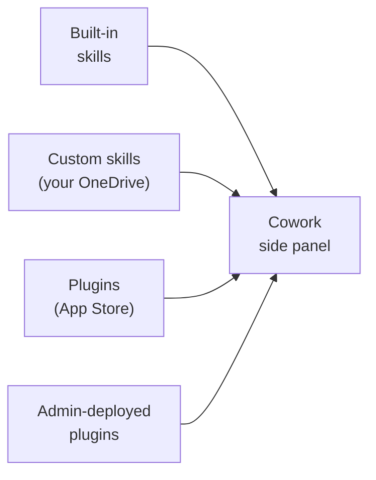

# Extending Cowork with Plugins

> **Frontier Preview**: part of [Getting Started with Cowork](../01-intro/readme.md). Features are subject to change.

Built-in skills handle common office tasks and [custom skills](../03-custom-skills/readme.md) capture your own recipes, but both live inside Microsoft 365. Plugins reach *beyond* it. A plugin from the **Microsoft 365 App Store** adds new skills and connects Cowork to external services and specialized expertise. Once installed, a plugin's skills appear alongside built-in skills and activate automatically based on context, exactly like the ones you already use.

---

## What Plugins Add

- **Specialized expertise**: financial analysis, legal research, clinical or HR domain knowledge
- **External data connectors**: CRM data, ticketing systems, third-party APIs
- **Admin deployment**: IT admins can roll out plugins organization-wide

---

## Where Plugins Fit

Cowork draws skills from four sources, and every one of them surfaces in the same side panel and activates the same way: automatically, based on the task.

Built-in skills handle the common office tasks. Custom skills handle *your* recurring workflows. Plugins reach into the systems and expertise your work depends on, and admin-deployed plugins let IT standardize that reach across the whole organization.

---

## Installing a Plugin

1. Open the **Microsoft 365 App Store** from the Cowork side panel or the Microsoft 365 app.
2. Find a plugin and select **Add** (or **Get it now**) to install it for your account.
3. Start a new Cowork task; the plugin's skills are now discoverable and load automatically when a task matches their description.

A plugin is packaged as a Microsoft 365 app: a manifest plus one or more agent skills in the open `SKILL.md` format. That is the same format you author for [custom skills](../03-custom-skills/readme.md), which is why a plugin's skills behave identically to the ones you write yourself, once installed.

---

## Community Plugins

Beyond the official App Store, the community publishes ready-to-install Cowork plugins. The [awesome-copilot-cowork-plugins](https://github.com/alexclowe/awesome-copilot-cowork-plugins) repository collects packaged plugins you can sideload, each a manifest plus its agent skills. The hands-on demo uses the `dietitian` plugin from that repository to show how an external, domain-specific plugin drops into Cowork and starts producing expert output.

---

## Hands-On Demo

- [Extend Cowork with a Community Plugin](./demo-01-plugins.md): install the `dietitian` plugin from the awesome-copilot-cowork-plugins repository, confirm its two skills appear in the side panel, and produce a client nutrition assessment and education handout that mix the plugin's expertise with Cowork's built-in Word skill.

---

## Where to Go Next

- **[Creating Custom Skills](../03-custom-skills/readme.md)**: author the in-house equivalent of a plugin skill
- **[Scheduling Prompts & Recurring Automation](../04-automation/readme.md)**: run plugin-driven work on a schedule
- **[Human-in-the-Loop](../06-staying-in-control/readme.md)**: approvals and governance for plugin-driven actions

---

## Links & Resources

- [Cowork Plugins](https://learn.microsoft.com/en-us/microsoft-365/copilot/cowork/cowork-plugins)
- [awesome-copilot-cowork-plugins (community)](https://github.com/alexclowe/awesome-copilot-cowork-plugins)
- [Use Cowork](https://learn.microsoft.com/en-us/microsoft-365/copilot/cowork/use-cowork)
- [Cowork Overview](https://learn.microsoft.com/en-us/microsoft-365/copilot/cowork/)
