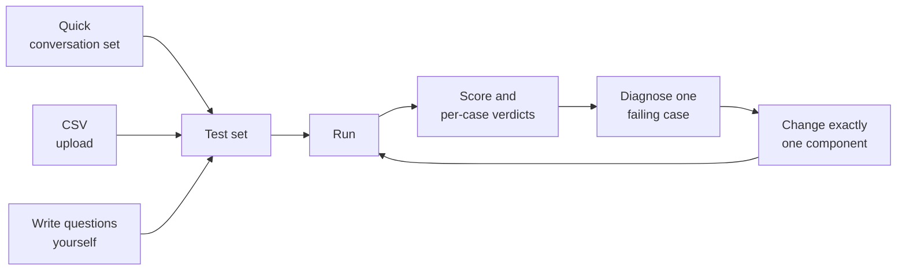
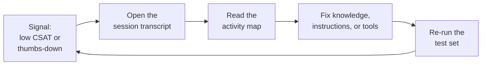
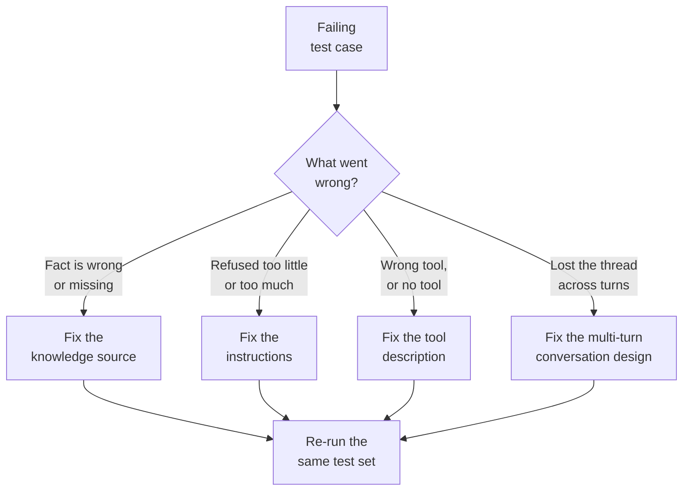

# Test and Evaluate Copilot Studio Agents

You have built an agent, grounded it, given it tools, and made it orchestrate; this topic answers the question that decides whether it ships: is it actually any good? A demo that works once tells you nothing about the hundred questions real users will ask, and a confident wrong answer is worse than no answer at all. Testing turns "it seemed fine when I tried it" into evidence you can defend, and evaluation shows you exactly where the agent falls short so you know what to fix. This is the discipline that separates a prototype from a production agent.

Copilot Studio splits the work into two halves that reinforce each other. Before release you run agent evaluations: repeatable test sets that score responses against expected answers or a quality standard, so a change you make today can be measured against the same bar tomorrow. After release you read the analytics: thumbs feedback, CSAT, session transcripts, and question themes that show how the live agent behaves with people you never scripted. Together they form a loop of measure, diagnose, fix, and re-measure.

This topic covers both Copilot Studio surfaces. The classic **Evaluation** page carries the mature grader library and the post-release analytics, and the new experience adds an **Evaluate** tab between **Preview** and **Monitor** whose scope is deliberately narrower while it matures. The concepts transfer completely; the controls do not, and knowing which is which saves a maker an afternoon.

## Why one-off testing fails

Every maker starts by testing in the chat pane, and every maker eventually gets burned by it. The chat pane is a great way to find out whether the agent responds at all, and a terrible way to find out whether it responds well. Three failures show up again and again, and each one is a direct argument for a test set.

The first is coverage. When you test by hand you ask the questions you happen to think of, which are the questions you already know the agent handles, so your confidence grows while your knowledge does not.

The second is regression. You fix a knowledge gap on Tuesday, and on Thursday the tightened instructions that fixed it have quietly broken a refusal that used to work; nothing tells you, because nobody re-asked Tuesday's questions. The third is subjectivity, where "that answer looks fine" is a judgement you cannot put in a release note or defend to a compliance reviewer.

A test set fixes all three at once. It is a fixed group of questions that never changes unless you change it, so coverage stays honest, every run re-checks everything, and the outcome is a number rather than an impression. The number is not the point on its own; the point is that the same number, produced the same way, is comparable across runs, across versions, and across people.

## The vocabulary that makes evaluation make sense

Evaluation has five terms, and mixing them up is the most common source of confusion in a class. Learn them once and the whole feature reads clearly.

| Term | What it means |
|------|---------------|
| Test case | One scenario you want the agent to handle: a question, and optionally the answer you expect back |
| Test set (evaluation) | A named group of test cases you run together as a unit |
| Test method (grader) | The rule that turns the agent's actual answer into a score or a pass and fail verdict |
| User profile | The authenticated identity the evaluation runs as, which decides what knowledge and connections the agent can actually reach |
| Run | One execution of a test set, saved with its own score and timestamp so runs can be compared |

The user profile deserves more attention than it usually gets. An agent grounded in SharePoint or reaching a connector behaves differently depending on who is asking, so a test set that runs as an over-privileged identity can pass while real users see nothing. Running evaluations under a profile whose access mirrors the audience is what keeps the score honest. In the new experience this is the **User profile** section with its **Manage** button, and connections that are ready show a green indicator.

## Two surfaces, two different evaluation features

This is the single most important thing to get right, because the two Copilot Studio experiences ship genuinely different evaluation features and the documentation for each is easy to mistake for the other. Classic agents have an **Evaluation** page with a rich grader library. New-experience agents have an **Evaluate** tab whose scope is deliberately narrower while it matures as a production-ready preview.

| | Classic Evaluation page | New-experience Evaluate tab |
|---|---|---|
| Test set types | Single response (up to 100 cases) and conversational (up to 20 cases) | Conversation only, shown as a `Data type: Conversation` label |
| Test methods | General quality, Compare meaning, Tool use, Keyword match, Text similarity, Exact match, Custom | General quality only |
| Grader scope | Several methods per test set, configured per case | One method for the whole test set |
| Expected responses | Required by every method except General quality | Optional, and not compared against by General quality |
| Ways to build a set | Manual, CSV import, quick question set, full question set, from test chat, from an analytics theme | CSV upload, Quick conversation set, or write questions yourself |
| Result detail | Score, per-case analysis, activity map, version comparison | Score, per-case Pass and Fail, per-conversation drill-down, run comparison |

Read that table twice before you teach the topic. A maker who follows a classic tutorial inside the new experience will spend twenty minutes hunting for a Tool use grader that is not there, and will conclude the product is broken when it is simply a different product surface. The safe framing for a class is that the classic page is the mature, feature-rich surface today, the new tab is the direction of travel, and the concepts (test set, case, grader, run, iterate) transfer completely even though the controls do not.

## What the Evaluate tab is made of

An evaluation on the new tab has four parts, and every one of them is visible in the **Configure test set** panel on the right. Getting the vocabulary straight against the actual controls prevents most of the confusion that follows.

A conversation is one test case: a sequence of user questions, each with an optional expected agent response, capped at six question-answer pairs. An evaluation is the named set those conversations belong to. The test method is the grader applied to the whole set rather than to individual cases. The user profile is the authenticated identity the run executes as.

That last one is quietly the most important. An evaluation that runs as an over-privileged identity reaches content your real users cannot see, so it produces the most flattering and least useful score available. Set the profile to match the audience, and check that its connections show as ready before you run.

## Building a test set that is worth trusting

A test set is only as good as the cases in it, and the instinct to fill it with the questions the agent already answers well is exactly wrong. A useful set is a deliberate sample of the job the agent actually has, weighted toward the places it is most likely to fail. Four categories belong in almost every set.

Grounded fact cases check that the agent retrieves and reports something from its knowledge correctly, and they are the cases that catch a broken or still-processing knowledge source. Guardrail cases check that the agent refuses what it should refuse, such as a binding price quote, legal advice, or anything outside its scope, and they are the cases that catch instructions that drifted too permissive. Off-topic cases check that the agent declines gracefully rather than answering from general model knowledge. Multi-turn cases check that the agent holds context, asks for the missing detail, and reaches the right end state across an exchange rather than a single reply.

## Three ways to fill a test set

The new tab offers three entry points, and they are good at different things rather than being three roads to the same place. The classic page adds three more (a full question set sized by you, seeding from a past test chat, and turning an analytics theme into a set), and that last one is the highest-value source of all because those cases are questions people actually asked.

**Quick conversation set** generates ten conversations from the agent's own description, instructions, and topics. It is the fastest route to breadth and it is structurally blind to the guardrails you never wrote down, because it reads the same instructions the agent answers from. Use it to discover scenarios and to grow a set you already trust, never to author one from nothing.

A CSV upload is how a test set travels. It moves between environments, gets reviewed in a spreadsheet by someone who will never open Copilot Studio, and survives an agent being rebuilt. The **CSV** link on the **Data source** panel downloads the template that defines the accepted format, and that template is the authority rather than any guide, because the surface is a production-ready preview and the format can change.

Writing questions by hand is the only way to get the cases that hurt: the refusal, the off-topic request, the multi-turn exchange where the agent has to ask which account before it can answer. A set built only from generation confirms your assumptions; a set with hand-written guardrails challenges them.

## What the graders actually measure

Picking a grader is picking a definition of "correct", and different questions have different definitions. On the classic surface you get a library to choose from, and choosing badly is how a good agent gets a bad score.

| Grader | Verdict | Use it when |
|--------|---------|-------------|
| General quality | Scored out of 100% | You want relevance, groundedness, and completeness judged without pinning exact wording |
| Compare meaning | Scored out of 100% | Many phrasings are correct and you care about intent, not words |
| Text similarity | Scored out of 100% | Wording and construction matter, for example generated legal or policy text |
| Exact match | Pass or fail | The answer is a code, a number, or a fixed phrase with one correct form |
| Keyword match | Pass or fail | Specific terms must appear, with Any or All deciding what counts as a pass |
| Tool use | Pass or fail | The behavior under test is whether the agent reached for the right capability |
| Custom | Pass or fail | Your criteria are domain-specific and you want to define the labels yourself |

Two practical rules keep grader choice sane. First, match the grader to what would make a human reviewer unhappy: if a reviewer would accept any correct phrasing, do not use Text similarity, and if a reviewer would reject a right answer produced by the wrong path, add Tool use. Second, remember that every grader except General quality needs an expected response or keyword list on the case; a case missing that input produces an **Invalid** result rather than a failure, and a set full of Invalid results reads as a broken evaluation when it is really an incomplete one.

Scored graders take a pass threshold, and the threshold is a policy decision rather than a technical one. Seventy percent is a common starting point for Compare meaning and Text similarity, high enough to catch a genuinely wrong answer and forgiving enough to survive normal phrasing variation. Set it too high and you will spend your time re-reading passing answers that scored 68; set it too low and the set stops discriminating.

## What General quality actually judges

This is the fact that most often trips a maker moving to the new tab, and it is worth stating bluntly. **General quality** is the only test method there, it applies to the whole set, and it judges responses against quality standards such as relevance and completeness. It does not compare the answer to your expected response.

Two consequences follow. A confidently worded wrong answer can pass, so the verdict is never a substitute for reading what the agent actually said. And the comparing graders from the table above are simply not present on that tab, so classic guidance describes controls it does not have.

Expected responses are still worth writing. They record what "correct" means for whoever maintains the set, they travel in the CSV, and they are what makes a failing case diagnosable rather than merely red. They just do not drive the number in the new experience.

## Reading a score without fooling yourself

A pass rate is a summary, and summaries hide the thing you need. The per-case table is where the useful information lives, because a set that moved from 80% to 85% might have fixed one case and broken another. Four outcomes are possible per case, and only two of them are about the agent.

**Pass** and **Fail** are verdicts about the agent's answer. **Invalid** means the case could not be graded, almost always because the grader needs an expected response or keyword the case does not have. **Error** means the run itself failed, for example an authentication or connection problem under the selected user profile. Invalid and Error results are your problem, not the agent's, and clearing them is the first thing to do on a messy first run.

Language-model graders are not deterministic, so the same set against an unchanged agent will move a few percent between runs. That variance is why a single run is a weak signal and why the discipline of running before and after a single change matters so much. A small score move is noise; a case that flips from fail to pass is signal. If a case flickers between runs without any change, the case itself is too rigid, and the fix is to loosen the expected response or lower the threshold rather than to keep re-running.

Change one thing at a time. If you sharpen instructions, add a knowledge source, and rewrite a tool description before re-running, a higher score tells you the bundle helped and nothing about which part did. The habit worth teaching is baseline, one change, re-run, record, repeat.

## From a low rating to a fix

The value of evaluation is the path it gives you from a symptom to a cause. A single thumbs-down or a dip in pass rate is a starting point, not a verdict, and the diagnosis tools let you walk from that signal to the exact decision the agent made. The flow below is the loop students practice: notice a weak signal, open the case, read what the orchestrator did, and change the knowledge, instructions, or tools that let it down.

The activity map is the diagnostic instrument that makes this loop more than guesswork. It shows the sequence of inputs, decisions, and tool calls behind a single response, so you can see whether the agent consulted the knowledge source at all, whether it picked the wrong tool, and where in a multi-step plan it went off course. Without it, a failing case tells you the answer was wrong; with it, you know which component to change.

Most failures fall into four buckets, and the bucket tells you the fix. A wrong or vague fact usually means the knowledge source is missing, still processing, or contains content too unstructured to retrieve cleanly. A missing refusal or a tone problem is almost always instructions.

The right answer reached through the wrong path, or a tool that fired when it should not have, is a tool description problem, because the orchestrator selects tools by matching a request against that description. A conversation that never recovers after a clarifying question is a multi-turn design problem rather than a content one.

## Where evaluation stops and Monitor begins

Evaluation tells you whether an answer met the bar. **Monitor** tells you what the agent actually did to produce it, which is a different and complementary question. A case can pass for the wrong reason, for example answering correctly from general model knowledge while never touching the knowledge source you added, and only the run detail on **Monitor** exposes that.

The habit worth teaching is to confirm a sample of passing cases on **Monitor** rather than only investigating failures. A green set that passed for the wrong reasons is a regression waiting to happen, because the next model update can take the shortcut away.

## Signals that only the live agent can give you

No test set anticipates the questions real people ask, which is why evaluation before release and analytics after release are complements rather than alternatives. The post-release signals answer a different question: not "does the agent meet my bar" but "is the agent working for the people using it".

Thumbs-up and thumbs-down reactions are the cheapest signal and the fastest route to a weak answer, especially when you filter to the negatives and read the transcripts behind them. CSAT from the End of Conversation survey gives a session-level satisfaction score, and it catches a different failure from a thumbs-down: an agent can answer every question correctly and still leave people unsatisfied because the conversation took too long or ended without resolving anything. Session transcripts hold the story behind a rating, including the outcome (resolved, escalated, abandoned, unengaged) that explains what actually happened.

User questions grouped into themes are the most valuable analytics artifact for a maker, because they tell you what people are really asking in their own words rather than what you imagined they would ask. A theme with high volume and poor outcomes is a direct instruction: that is where the next knowledge source or the next topic belongs. The loop closes when you turn a theme into a test set, which promotes a real-world gap into a permanent regression check.

## Choosing between evaluation and analytics

| You want to know | Reach for |
|------------------|-----------|
| Does a fixed set of questions still pass after my change | A test set with a tracked score, run before and after |
| Did the agent use the right knowledge, topic, or tool | The Tool use grader plus the activity map |
| Are there many correct phrasings of the answer | Compare meaning, or General quality |
| Does the exact wording matter, as in generated policy text | Text similarity with a pass threshold |
| Does a multi-step conversation reach the right end state | A conversational (multi-turn) test case |
| Are live users happy with the agent | CSAT from the End of Conversation survey |
| Which specific answers are users rejecting | Thumbs-down reactions, filtered, with transcripts |
| What are users really asking in their own words | User questions grouped into themes |
| Did the new version regress against the old one | Version comparison across runs of the same set |
| Automated regression testing across hundreds of cases | The Copilot Studio Kit test automation suite |

## Scaling beyond the maker surface

A test set you run by hand before each release is already a large improvement, and it is not where a serious team stops. Three moves take evaluation from a maker habit to an engineering practice.

Export results to CSV. Results live in Copilot Studio for 89 days, which is shorter than most audit and compliance windows, and the exported file carries the question, expected response, test method, pass score, actual response, verdict, and analysis for every case. That file is what you attach to a release record or hand to a reviewer who has no Copilot Studio access.

Move bulk testing to the Copilot Studio Kit when the set outgrows the maker UI. The Kit's test automation suite runs large sets, supports test types such as response match, topic match, and multi-turn, and groups tests into sets assigned to an agent as a test run. The Power Platform API for evaluation is the other half of this story, because an evaluation you can call from an API is an evaluation you can put in a pipeline.

Make evaluation a release gate rather than a ritual. The habit worth building is that every meaningful change re-runs the same set, every release records its score, and a drop blocks promotion until it is explained. That turns the test set into a contract, and it is the same reasoning that pushes evaluation into the ALM pipeline covered in the maintaining module.

## Pitfalls to name in class

| Pitfall | Why it bites | What to do instead |
|---------|--------------|--------------------|
| Following a classic evaluation tutorial in the new experience | The graders and test set types differ, so the controls described are not there | Confirm which experience the agent is in first, then use the matching guidance |
| Assuming General quality compares to the expected response | It judges quality standards, not similarity to your answer, so a wrong answer can pass | Use Compare meaning or Text similarity on the classic surface when the expected answer must be matched |
| A set full of Invalid results | Graders other than General quality need an expected response or keywords per case | Fill in the expected inputs, or switch those cases to General quality |
| Chasing a two-point score move | Language-model graders vary run to run | Act on cases that flip pass to fail, not on small aggregate moves |
| Changing three things then re-running | A higher score cannot be attributed to any one change | One change per run, and record what it was |
| Only testing what the agent does well | The set confirms your assumptions instead of challenging them | Deliberately add guardrail, refusal, and off-topic cases |
| Running evaluations as an over-privileged identity | The agent reaches knowledge and connections real users cannot | Set a user profile whose access mirrors the intended audience |

## Hands-On Lab

- [Evaluate a New-Experience Agent with Test Sets](../../../../labs/03-copilot-studio/04-ui-update/03-evaluations/lab-01-evaluate-with-test-sets.md): Ground an agent, install weak instructions on purpose, fill a test set three ways, run a baseline, diagnose every failure into a component bucket, change one thing, and prove the fix with a second run of the identical set.
- [Build, Evaluate, and Monitor a Northwind Sales Assistant](../../../../labs/03-copilot-studio/04-ui-update/02-unified-build-and-orchestrator/lab-01-evaluate-and-monitor-agent.md): Work all four tabs end to end, from composing the agent on Build through scoring it on Evaluate and reviewing its runs on Monitor.

## Key Topics covered in this module

[About agent evaluation](https://learn.microsoft.com/microsoft-copilot-studio/analytics-agent-evaluation-intro)

[Choose evaluation methods](https://learn.microsoft.com/microsoft-copilot-studio/analytics-agent-evaluation-overview)

[Create test cases to evaluate your agent](https://learn.microsoft.com/microsoft-copilot-studio/analytics-agent-evaluation-create)

[Create a conversational test set](https://learn.microsoft.com/microsoft-copilot-studio/analytics-agent-evaluation-multi-turn)

[Run evaluations and view results](https://learn.microsoft.com/microsoft-copilot-studio/analytics-agent-evaluation-results)

[Evaluate an agent in the new experience](https://learn.microsoft.com/microsoft-copilot-studio/agents-experience/analytics-agent-evaluation-intro)

[Create a test set for an agent (new experience)](https://learn.microsoft.com/microsoft-copilot-studio/agents-experience/analytics-agent-evaluation-create)

[View evaluation results for an agent (new experience)](https://learn.microsoft.com/microsoft-copilot-studio/agents-experience/analytics-agent-evaluation-view)

[Analyze conversational agents and improve effectiveness](https://learn.microsoft.com/microsoft-copilot-studio/analytics-improve-agent-effectiveness)

[Review agent activity and session activity maps](https://learn.microsoft.com/microsoft-copilot-studio/authoring-review-activity)

[Configure tests with the Copilot Studio Kit](https://learn.microsoft.com/microsoft-copilot-studio/guidance/kit-configure-tests)

## Where to Go Next

Evaluation is the checkpoint between building and running an agent, so it points in both directions. Look back to [The Unified Build Surface and the New Orchestrator](../02-unified-build-and-orchestrator/readme.md) when a failing case points at instructions, knowledge, or a tool, since that is where the behavior you are grading is configured. Look further back to [Advanced Copilot Studio Agents](../../03-advanced/readme.md) when a test reveals an orchestration or tool-selection gap in a classic agent.

Look sideways to [Agent Skills in Copilot Studio](../04-agent-skills/readme.md), because a skill is another component a test set can hold accountable. Look forward to [Publishing, Maintaining & Governing Copilot Studio Agents](../../../04-maintaining/readme.md) to fold these test sets into an ALM pipeline, so evaluation runs as a gate before every promotion rather than a one-time manual check.

The goal is a standing habit: every meaningful change re-runs the same test set, and every release is read through live analytics before you call it done. A team that does this can answer the question that started this topic (is the agent any good) with a number, a trend, and a transcript, instead of an opinion.

## Links & Resources

- [Microsoft Copilot Studio documentation](https://learn.microsoft.com/en-us/microsoft-copilot-studio/)
- [About agent evaluation](https://learn.microsoft.com/en-us/microsoft-copilot-studio/analytics-agent-evaluation-intro)
- [Create test cases to evaluate your agent](https://learn.microsoft.com/en-us/microsoft-copilot-studio/analytics-agent-evaluation-create)
- [Run evaluations and view results](https://learn.microsoft.com/en-us/microsoft-copilot-studio/analytics-agent-evaluation-results)
- [Evaluate agents with the Power Platform API](https://learn.microsoft.com/en-us/microsoft-copilot-studio/analytics-agent-evaluation-rest-api)
- [Analyze user questions by theme](https://learn.microsoft.com/en-us/microsoft-copilot-studio/analytics-themes)
- [Understand downloaded session data](https://learn.microsoft.com/en-us/microsoft-copilot-studio/analytics-transcripts-studio)
- [Measure and improve agent performance with KPIs and analytics](https://learn.microsoft.com/en-us/microsoft-copilot-studio/guidance/analytics)
