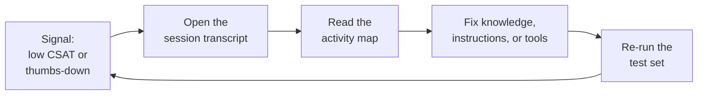

# Testing & Evaluating Copilot Studio Agents

You have built an agent, grounded it, given it tools, and made it orchestrate; this topic answers the question that decides whether it ships: is it actually any good? A demo that works once tells you nothing about the hundred questions real users will ask, and a confident wrong answer is worse than no answer at all. Testing turns "it seemed fine when I tried it" into evidence you can defend, and evaluation shows you exactly where the agent falls short so you know what to fix. This is the discipline that separates a prototype from a production agent.

Copilot Studio splits the work into two halves that reinforce each other. Before release you run Agent Evaluations (generally available): repeatable test sets that score responses against expected answers or a quality standard, so a change you make today can be measured against the same bar tomorrow. After release you read the analytics: thumbs feedback, CSAT, session transcripts, and question themes that show how the live agent behaves with people you never scripted. Together they form a loop of measure, diagnose, fix, and re-measure.

## What to teach

- Agent Evaluations (GA): the built-in evaluation surface that simulates conversations with your agent, scores each test case Pass, Fail, Invalid, or Error, and rolls the results into a pass rate you can track across runs.
- Creating test sets: build a set of test cases manually, import them from a CSV file, or generate them automatically from the agent's instructions, knowledge, and topics, and seed cases from past test-chat conversations.
- Multi-turn conversation tests: evaluate a whole conversation rather than a single question, so agents that gather context or slot-fill across turns are graded on the full exchange.
- Test methods: pick the right yardstick per case, from exact and keyword match to text similarity, compare meaning, tool use, and general quality, and combine methods in one set.
- Feedback and activity maps: use thumbs-up and thumbs-down reactions to spot weak answers, then open the activity map to see the sequence of inputs, decisions, and tools behind a single response for root-cause diagnosis.
- User questions and reactions: view and filter what users actually asked and how they reacted, group questions into themes, and turn a theme into a new test set in one step.
- CSAT and transcripts: read the End of Conversation satisfaction score and open session transcripts to understand the story behind a low rating.
- Exporting and scaling: export evaluation results to CSV for longer retention and offline analysis, and move to the Copilot Studio Kit when you need bulk, automated testing at scale.

## Evaluation before release versus signals after release

| You want to know | Reach for |
|------------------|-----------|
| Does a fixed set of questions still pass after my change | An Agent Evaluation test set with a tracked pass rate |
| Did the agent use the right knowledge, topic, or tool | The tool-use test method plus the activity map |
| Are there many correct phrasings of the answer | The compare-meaning or text-similarity method |
| Does a multi-step conversation reach the right end state | A multi-turn conversation test case |
| Are live users happy with the agent | CSAT from the End of Conversation survey |
| Which specific answers are users rejecting | Thumbs-down reactions, filtered, with transcripts |
| What are users really asking in their own words | User questions grouped into themes |
| Automated regression testing across hundreds of cases | The Copilot Studio Kit test automation suite |

## From a low rating to a fix

The value of evaluation is the path it gives you from a symptom to a cause. A single thumbs-down or a dip in pass rate is a starting point, not a verdict, and the diagnosis tools let you walk from that signal to the exact decision the agent made. The flow below is the loop students practice: notice a weak signal, open the case, read what the orchestrator did, and change the knowledge, instructions, or tools that let it down.

## Key Topics covered in this module

[About agent evaluation](https://learn.microsoft.com/microsoft-copilot-studio/analytics-agent-evaluation-intro)

[Choose evaluation methods](https://learn.microsoft.com/microsoft-copilot-studio/analytics-agent-evaluation-overview)

[Create test cases to evaluate your agent](https://learn.microsoft.com/microsoft-copilot-studio/analytics-agent-evaluation-create)

[Run evaluations and view results](https://learn.microsoft.com/microsoft-copilot-studio/analytics-agent-evaluation-results)

[Analyze conversational agents and improve effectiveness](https://learn.microsoft.com/microsoft-copilot-studio/analytics-improve-agent-effectiveness)

[Review agent activity and session activity maps](https://learn.microsoft.com/microsoft-copilot-studio/authoring-review-activity)

[Configure tests with the Copilot Studio Kit](https://learn.microsoft.com/microsoft-copilot-studio/guidance/kit-configure-tests)

## Where to Go Next

Evaluation is the checkpoint between building and running an agent, so it points in both directions. Look back to [Advanced Copilot Studio Agents](../03-advanced/readme.md) when a test reveals an orchestration or tool-selection gap, since that is where the planning behavior you are grading is configured. Look forward to [Publishing, Maintaining & Governing Copilot Studio Agents](../../04-maintaining/readme.md) to fold these test sets into an ALM pipeline, so evaluation runs as a gate before every promotion rather than a one-time manual check. The goal is a standing habit: every meaningful change re-runs the same test set, and every release is read through live analytics before you call it done.

## Links & Resources

- [Microsoft Copilot Studio documentation](https://learn.microsoft.com/en-us/microsoft-copilot-studio/)
- [About agent evaluation](https://learn.microsoft.com/en-us/microsoft-copilot-studio/analytics-agent-evaluation-intro)
- [Create test cases to evaluate your agent](https://learn.microsoft.com/en-us/microsoft-copilot-studio/analytics-agent-evaluation-create)
- [Run evaluations and view results](https://learn.microsoft.com/en-us/microsoft-copilot-studio/analytics-agent-evaluation-results)
- [Evaluate agents with the Power Platform API](https://learn.microsoft.com/en-us/microsoft-copilot-studio/analytics-agent-evaluation-rest-api)
- [Analyze user questions by theme](https://learn.microsoft.com/en-us/microsoft-copilot-studio/analytics-themes)
- [Measure and improve agent performance with KPIs and analytics](https://learn.microsoft.com/en-us/microsoft-copilot-studio/guidance/analytics)
