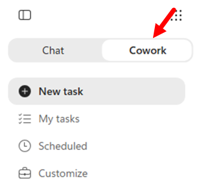
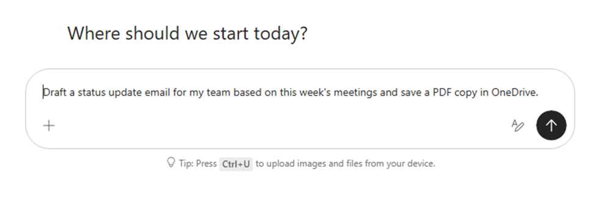
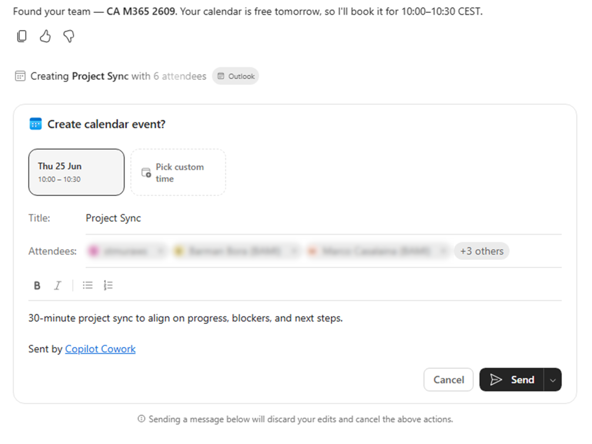

# Lab 01: Copilot Cowork Setup and Extensibility

In this lab you learn what Copilot Cowork is, how to prepare your tenant for Cowork, and which extensibility options are available to tailor Cowork to your organization's needs.

At a high level, Cowork can orchestrate multi-step work across Microsoft 365, including communication, calendar tasks, document creation, research, and automation. Cowork interacts with Microsoft 365 through Work IQ, which is part of the Microsoft IQ Platform. Unlike a pure Q&A experience, Cowork can move from intent to action while keeping the user in control.

## Exercise 1: Understand what Copilot Cowork is

In this exercise you explore the core Cowork experience and understand how it differs from a chat-only AI assistant.

Copilot Cowork is built for execution, not only conversation. Instead of only answering prompts, Cowork interprets a goal, breaks it into tasks, selects the needed skills, and coordinates actions across Microsoft 365 workloads such as Outlook, Teams, Word, Excel, PowerPoint, and enterprise search. The operating model is goal-driven orchestration: users provide intent, Cowork builds and runs a plan, and users can inspect each step while the work progresses.

The main advantage of this model is practical productivity at scale. Cowork can handle multi-step, cross-app workflows that normally require context switching, manual copy/paste, and repeated coordination. It also keeps humans in control through approvals for sensitive actions. Users can delegate more operational work without losing visibility, governance, or trust.

Organizations need Cowork because modern work is fragmented across tools, messages, meetings, and documents, while execution speed and consistency matter more than ever. Cowork addresses this by turning intent into reliable action inside existing Microsoft 365 security, identity, and compliance boundaries. In this lab you first understand the foundation, then configure the tenant prerequisites, and finally explore extensibility options.

### Step 1: Review what Cowork can do

Review the capabilities described in [Copilot Cowork overview](https://learn.microsoft.com/en-us/microsoft-365/copilot/cowork/). At the time of writing, key capabilities include:

- Communication tasks (email and Teams messages)
- Meeting and calendar tasks (scheduling, updates, conflict cleanup)
- Document and file tasks (Word, Excel, PowerPoint, PDF)
- Research and enterprise search across Microsoft 365 data
- Scheduled prompts for recurring automations

This aligns with the product vision introduced in [Copilot Cowork: A new way of getting work done](https://www.microsoft.com/en-us/microsoft-365/blog/2026/03/09/copilot-cowork-a-new-way-of-getting-work-done/), where Cowork focuses on moving from intent to action.

From an interaction model perspective, Cowork is designed to run a sequence of actions, not just return a one-shot answer. It can draft and send communications, create files, organize meetings, and combine context from emails, chats, files, and meetings into a cohesive execution plan.

One of the biggest benefits is continuity of work. Instead of jumping between Outlook, Teams, OneDrive, SharePoint, and Office apps manually, users delegate the end-to-end flow to Cowork and then supervise checkpoints. This reduces context switching and keeps work moving while users focus on high-value decisions.

Cowork also keeps control in the hands of the user. For higher-impact operations, Cowork pauses for approval before execution. This pattern is critical for enterprise trust because users can review intent, approve or reject actions, and maintain accountability while still gaining automation.

At organizational level, Cowork exists to help teams turn intent into consistent execution in a secure Microsoft 365 boundary. As highlighted in Microsoft guidance, the objective is not replacing people, but amplifying execution capacity with auditable, policy-aligned automation that can be extended with skills and plugins.

## Exercise 2: Prepare your tenant for Copilot Cowork

In this exercise you configure the core tenant prerequisites required to enable Cowork safely.

### Step 1: Validate prerequisites

Review [Get started with Copilot Cowork](https://learn.microsoft.com/en-us/microsoft-365/copilot/cowork/get-started) and confirm the following prerequisites:

- You have a valid Microsoft 365 tenant where you can experiment and learn, for example a developer tenant created through the [Microsoft 365 Developer Program](https://developer.microsoft.com/en-us/microsoft-365/dev-program)
- You have a tenant admin account to manage the required settings
- Users have an active Microsoft 365 Copilot license
- Cowork is available in your tenant
- Usage-based billing is enabled for Cowork
- Anthropic as a subprocessor is enabled for your tenant, or you are in a Frontier tenant so that you can choose GPT 5.5 instead
- Supported client/browser access is available (web, desktop app, mobile)

> **Note: Anthropic subprocessor requirement.** Cowork uses Anthropic models as a subprocessor in Microsoft 365 Copilot. Make sure your compliance and legal review process includes this prerequisite before broad rollout. In Frontier tenants you can also use GPT 5.5 as an alternative. Read [Choose a model for Copilot Cowork](https://learn.microsoft.com/en-us/microsoft-365/copilot/cowork/cowork-models) for the supported models.

### Step 2: Configure Copilot Credits and usage-based billing

In the Microsoft 365 admin center, open the cost management experience for usage-based billing and configure your billing strategy based on [Usage-Based Billing and Cost Management for Copilot Credits](https://learn.microsoft.com/en-us/microsoft-365/copilot/usage-based-billing-overview-copilot-credits).

Define at least:

- Billing mode (prepaid credits, pay-as-you-go, or existing capacity)
- Azure subscription connection for billing at scale
- Spending policies and limits
- Budget protections (alerts and hard caps)

> **Important: pilot first.** Start with a controlled pilot audience and strict spending policies. Expand gradually after reviewing real consumption trends and cost drivers.

### Step 3: Assign pilot users and verify access

Assign a pilot group, ask pilot users to open Cowork, and validate that they can:

- Start conversations
- Run at least one task requiring approval
- See task history and scheduled tasks

If users cannot access Cowork, recheck licensing, billing configuration, and tenant-level enablement.

## Exercise 3: Start using Copilot Cowork

In this exercise you start using Cowork in the product experience, observe the execution model in action, and validate approval controls for sensitive actions.

### Step 1: Open Cowork

Open [Microsoft 365 Copilot](https://m365.cloud.microsoft) and select **Cowork** in the top toggle next to **Chat**.



Notice that Cowork is oriented around delegated execution: you describe an outcome and Cowork plans and performs tasks for you across Microsoft 365.

In the left navigation you find these core options:

- **New task**: start a new Cowork execution from scratch with a fresh prompt.
- **My tasks**: find previous tasks and reopen past work quickly.
- **Scheduled**: review and manage recurring or scheduled Cowork tasks.
- **Customize**: manage available plugins and skills for your Cowork experience.

### Step 2: Observe the execution model

From the Cowork home page, start a simple prompt such as:

```text
Draft a status update email for my team based on this week's meetings and save a PDF copy in OneDrive.
```



As Cowork runs, observe the step-by-step execution, the loaded skills, and the approval gates before sensitive actions such as sending or posting.


Once the work is complete, you see a recap of all executed tasks and steps.


Cowork executed multiple tasks: it created a draft of an email, generated a PDF, and stored it in your OneDrive for Business. All of that ran asynchronously, so you could work on something else in the meantime.

### Step 3: Test approval controls

Ask Cowork to perform a sensitive action, for example:

```text
Schedule a 30-minute project sync with my team tomorrow and send a confirmation message in Teams.
```



Verify that Cowork requests explicit approval before the sensitive action is executed.

## Exercise 4: Explore Cowork extensibility options

This lab series focuses on the Cowork extensibility model. In this exercise you compare the main extensibility options and review the plugins and skills already available.

### Step 1: Open the Customize experience

In Cowork, select **Customize** from the left navigation. You find two key tabs:

- **Plugins**: installed, discoverable, and shared plugins
- **Skills**: built-in skills and your custom skills

Before continuing, keep this simple comparison in mind:

- **Skills** are task instructions and behavior patterns that guide how Cowork should execute specific types of work.
- **Plugins** are packaged integrations and connectors that add capabilities or external data sources Cowork can use.
- Choose **Skills** when you need to shape behavior and task logic. Choose **Plugins** when you need to connect tools, systems, or specialized packaged functionality.

Cowork already includes a rich set of built-in skills such as Word, Excel, PowerPoint, PDF, Email, Scheduling, Calendar Management, Meetings, Daily Briefing, Enterprise Search, Deep Research, Communications, and Adaptive Cards. These skills are automatically activated by Cowork based on the conversation context, and you can see which ones were used in the **Skills** section of the side panel.

> Read [Cowork skills](https://learn.microsoft.com/en-us/microsoft-365/copilot/cowork/use-cowork#cowork-skills) to learn more about the built-in skills.

The Microsoft plugins currently included in Cowork are:

- **Dynamics 365 Customer Service**
- **Dynamics 365 ERP**
- **Dynamics 365 Sales**
- **Fabric IQ**

Beyond these Microsoft plugins, a broad catalog of third-party partner plugins is available in the Microsoft 365 App Store, and that catalog keeps growing.

## Summary

You now know what Copilot Cowork is, how it differs from chat-only assistants, which tenant prerequisites it needs, and where its two extensibility surfaces (skills and plugins) live.

Continue with [Lab 02: Build your first Cowork skill](./lab-02-cowork-skills.md).
