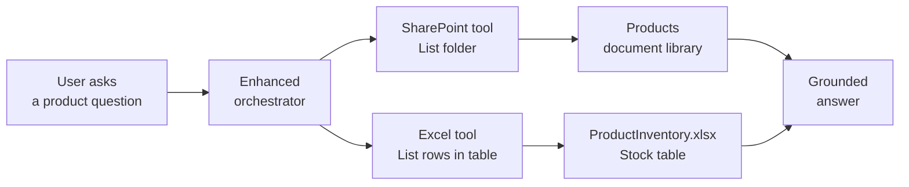

# Give a Product Support Agent Live SharePoint and Excel Data with Connector Tools

Your product support team keeps its material in two places: the datasheets, manuals, and troubleshooting guides sit in a SharePoint document library, and the current stock and warranty figures live in an Excel workbook next to them. A knowledge source can read those files, but it cannot tell a user what is in the folder right now or what today's stock number is. Connector tools can, because they call the SharePoint and Excel APIs at conversation time and hand the result back to the orchestrator.

In this lab you build a Product Support Assistant in the new Copilot Studio experience and give it two prebuilt connector tools: SharePoint List folder and Excel List rows present in a table. You then tune the tool descriptions until the orchestrator picks the right tool on its own, inspect the reasoning to prove which tool ran, and publish the agent to Microsoft 365 Copilot.

This is a rewrite of the Microsoft Learn lab [Create a connector action](https://microsoftlearning.github.io/MS-4022-Extend-Microsoft-365-Copilot-in-Copilot-Studio/Instructions/Labs/03-Connector-actions/01-create-connector-action.html) for the new agent experience, extended with the Excel and SharePoint scenarios from Copilot Camp.

## What you'll build

- A Product Support Assistant agent authored on the **Build** tab of the new Copilot Studio experience.
- A SharePoint connector tool that lists the live contents of a `Products` document library.
- An Excel connector tool that reads a stock table out of a workbook in that same library.
- Agent instructions that route a question to the right tool, and tool descriptions tuned until the orchestrator stops guessing.
- A published agent that answers product support questions inside Microsoft 365 Copilot.

## How the pieces fit



## Prerequisites

- A Microsoft 365 tenant with Microsoft 365 Copilot and a Copilot Studio license, and permission to create agents.
- The new agent experience turned on. Open [Copilot Studio](https://copilotstudio.microsoft.com/), and use the **New experience** toggle on the home page. You are in the new experience when the agent surface shows **Build**, **Preview**, **Evaluate**, and **Monitor** tabs instead of **Topics**, **Knowledge**, **Actions**, and **Settings**.
- A SharePoint communication or team site named `Product Support`. Note its URL, for example `https://contoso.sharepoint.com/sites/ProductSupport`.
- A document library on that site named `Products`, holding the five files from the [assets](./assets/) folder next to this lab. Upload all five as they are; the names and the contents are what the exercises test against.

> **Note:** The new agent experience is a production-ready preview. Some connector configuration screens still open the shared tool details page that the classic experience uses, so a few panes in this lab look like classic Copilot Studio even though you author on the **Build** tab. That is expected and does not break anything.

## Lab files

Everything the agent reads is in [assets](./assets/). The content is fictional (Northwind Devices, a hardware vendor) but internally consistent, so answers about one product line up across the documents and the stock table.

| File | What it represents |
|------|--------------------|
| `Aurora-X1-Datasheet.pdf` | Product datasheet for the Aurora X1 conference camera: specification table, room sizing, SKU list |
| `Aurora-X1-Troubleshooting.docx` | Support desk troubleshooting guide: symptom table, escalation path, known issues |
| `Nimbus-500-Manual.pdf` | Installation and administration manual for the Nimbus 500 access point: mounting, radio plan, status lights |
| `Nimbus-500-Warranty.docx` | Warranty terms for the Nimbus 500: coverage table, extension, claim process, exclusions |
| `ProductInventory.xlsx` | Stock workbook, sheet `Inventory`, table `Stock`, 12 rows: product code, name, units in stock, warehouse, warranty months |

### Provision the library automatically

The [setup](./setup/) folder creates the `Products` library and uploads all five files in one run, with PnP PowerShell, a PnP site template, or the CLI for Microsoft 365. Read [setup/readme.md](./setup/readme.md) for the options and the one-time app registration PnP needs.

```powershell
cd setup
$env:PNP_CLIENT_ID = "<your client id>"
./Provision-ProductSupport.ps1 -SiteUrl "https://contoso.sharepoint.com/sites/product-support"
```

### Or upload by hand

1. Open your `Product Support` site and go to the `Products` library.
2. Select **Upload**, then **Files**, and select all five files from the `assets` folder.
3. Open `ProductInventory.xlsx` in Excel for the web and confirm that the range `A1:E13` is a table named `Stock`. Select any cell in the data, then check the name in the **Table Design** tab.

The `Stock` table looks like this:

```text
ProductCode | ProductName | UnitsInStock | WarehouseLocation | WarrantyMonths
AUR-X1      | Aurora X1   | 142          | Vienna            | 24
NIM-500     | Nimbus 500  | 18           | Graz              | 12
```

## Exercise 1: Create the Product Support Assistant

In the new experience you do not start with topics and trigger phrases. You start by describing the agent in natural language, and the enhanced orchestration runtime works out at run time which knowledge and which tool a question needs. The instructions you write here are the only behaviour contract the agent has, so they carry more weight than in the classic experience.

1. Sign in to [Copilot Studio](https://copilotstudio.microsoft.com/).
2. On the **Home** page, select the **Agent** tile. The agent designer opens with the **Build** tab active and the name field in focus.
3. Enter the name:

```text
Product Support Assistant
```

4. In the **Instructions** editor, paste the following:

```text
You are the Product Support Assistant for the hardware support desk.

You help support agents and customers with questions about our product range: what
support material exists for a product, and what the current stock and warranty
situation is.

Rules:
- Answer only questions about our products, their support material, and their stock.
- Always state where a fact came from: the Products document library or the stock table.
- If you do not have a fact, say so plainly instead of estimating.
- Keep answers short. Use a bulleted list when you return more than three items.
```

5. Select the **Save** icon in the upper-right corner.

Expected: the agent name appears in the header, the **Share** button becomes available, and the **Preview** and **Evaluate** tabs are no longer greyed out.

## Exercise 2: Add the SharePoint List folder connector tool

A connector tool is a single action from a Power Platform connector, exposed to the orchestrator as something the agent may call. SharePoint ships as a standard connector, so it is included with every Copilot Studio plan. The **List folder** action returns the items in one folder of one document library, which is exactly the live view a knowledge source cannot give you.

1. On the **Build** tab, in the components panel on the right, select **Tools**.
2. In the **Add a tool** dialog, select the **Connectors** tab.
3. In the search box, type `SharePoint` and press Enter.
4. From the SharePoint action list, select **List folder**.
5. Review the details pane. It names the action, its description, and the inputs it needs.
6. If the connection status shows **Not connected**, open the dropdown and select **Create new connection**.
7. In the connection dialog, choose **Connect directly (cloud services)**, then select **Create**, and sign in with your Microsoft 365 account.
8. Select **Add** to add the tool to the agent.

Expected: a **List folder** entry appears under **Tools** in the components panel, and the connection shows a green connected state rather than **Not connected**.

> **Tip:** If the SharePoint entry shows dozens of actions, filter with the word `folder`. Do not pick **List root folder**; it returns the top level of the site, not the `Products` library, and produces confusing answers later.

## Exercise 3: Configure the SharePoint tool so the orchestrator can find it

The orchestrator has no memory of your intent. It reads the tool name, the description, and the input descriptions, and from those alone decides whether a user question is a job for this tool. A tool called List folder with the stock description that ships by default competes with every other tool you add. Renaming it in business language and pinning its inputs to fixed values is what makes selection reliable.

1. Under **Tools**, select the **List folder** tool to open its details page.
2. Change **Name** to:

```text
List product support files
```

3. Change **Description** to:

```text
Lists the product support files that are currently available in the Products document
library on the Product Support SharePoint site. Use this when the user asks which
manuals, datasheets, troubleshooting guides, or warranty documents exist for a product.
```

4. Expand **Additional details** and set the end user authentication description to:

```text
Please sign in to access the Product Support SharePoint site.
```

5. Under **Inputs**, find **Site Address**. Set how the agent fills the input to a fixed value and select your `Product Support` site, or paste its URL.
6. Find **File Identifier**. Switch it to **Custom** and enter:

```text
Products
```

7. Select **Save**.

Expected: the tool now appears in the components panel as **List product support files**, and both inputs show as maker-set values rather than as values the agent must ask the user for.

## Exercise 4: Route questions to the tool and watch it fire

Instructions and tool descriptions work together. The description tells the orchestrator what the tool can do, the instructions tell it when your business wants it used. Adding an explicit routing line is the cheapest way to stop an agent from answering a live-data question from its own general knowledge. The **Preview** tab's maker view then shows you the reasoning card, so you can prove which path it actually took.

1. Return to the **Build** tab and add the following to the end of your **Instructions**:

```text
When the user asks what support material, documents, manuals, or files exist for a
product, call the "List product support files" tool and answer only from what it
returns. Name the tool you used in your answer.
```

2. Select **Save**.
3. Open the **Preview** tab and make sure **End user preview** is toggled off so you get the maker view.
4. Select **New chat**, then send:

```text
What product support files are available?
```

5. If a **Connect to continue** card appears, select **Allow** and sign in.
6. Expand the reasoning card shown with the response.

Expected: the answer lists the real file names from your `Products` library, states that it used the SharePoint tool, and the reasoning card shows a tool execution step naming **List product support files** together with the values it returned.

## Exercise 5: Add the Excel List rows connector tool

File names answer what exists. They cannot answer how many are left. Excel Online (Business) is a second standard connector whose **List rows present in a table** action reads a named table out of a workbook and returns it as structured rows, which the orchestrator can filter, count, and summarise. Because the workbook lives in the same library, you get live business data next to the documents without moving anything.

1. Go back to the **Build** tab and select **Tools** in the components panel.
2. On the **Connectors** tab, search for `Excel Online (Business)`.
3. Select the **List rows present in a table** action.
4. Create a connection if prompted, using the same Microsoft 365 account.
5. Select **Add**.

Expected: a second tool entry appears under **Tools** alongside your SharePoint tool.

> **Warning:** Excel Online (Business) reads a formatted table, not a plain range. If `ProductInventory.xlsx` has no table named `Stock`, the table picker in the next exercise is empty. Open the workbook, select the data, choose **Format as Table**, then rename the table to `Stock` in the Table Design tab.

## Exercise 6: Point the Excel tool at the stock table

Four inputs identify a table in Microsoft 365: the location (the SharePoint site), the document library, the file, and the table inside it. Pinning all four to fixed values turns a general purpose connector into a single-purpose business tool. It also removes four questions the agent would otherwise have to ask the user before it could answer anything.

1. Select the **List rows present in a table** tool to open its details page.
2. Change **Name** to:

```text
Get product stock levels
```

3. Change **Description** to:

```text
Returns the current stock table for all products, including product code, product name,
units in stock, warehouse location, and warranty length in months. Use this when the
user asks about availability, stock, quantities, warehouses, or warranty duration.
```

4. Under **Inputs**, set the values as fixed maker-provided values:

| Input | Value |
|-------|-------|
| Location | your `Product Support` SharePoint site |
| Document Library | `Products` |
| File | `ProductInventory.xlsx` |
| Table | `Stock` |

5. Select **Save**.

Expected: the tool is listed as **Get product stock levels**, and all four inputs show concrete values rather than an agent-filled placeholder.

## Exercise 7: Make the orchestrator choose between two tools

With one tool, selection is trivial. With two, the orchestrator has to discriminate, and this is where vague descriptions show up as wrong answers. Add a routing rule for the second tool, then deliberately ask a question that needs both tools in one turn and read the plan the orchestrator built.

1. On the **Build** tab, add this to your **Instructions**:

```text
When the user asks about availability, stock, quantities, warehouse, or warranty length,
call the "Get product stock levels" tool. When a question needs both the available
documents and the stock figures, call both tools and combine the results into one answer.
```

2. Select **Save**, then open **Preview** and select **New chat**.
3. Send:

```text
How many Nimbus 500 units do we have in stock, and where are they?
```

4. Then send:

```text
Give me everything you have on the Aurora X1: which support documents exist and how many
units are left.
```

Expected: the first answer quotes the units and warehouse from your table. The second answer contains both file names and stock figures, and the reasoning card shows two tool execution steps in one turn, one per tool.

## Exercise 8: Tune a description until mis-selection stops

Tool selection quality is a description problem, not a model problem. The fastest way to see this is to break it on purpose: make one description vague, watch the orchestrator pick the wrong tool, then repair it. This is the debugging loop you will use on every real agent, and the reasoning card is the instrument.

1. Open **Get product stock levels** and temporarily replace its description with:

```text
Gets product data.
```

2. Save, open **Preview**, select **New chat**, and send:

```text
What warranty do we give on the Nimbus 500?
```

3. Read the reasoning card and note which tool the orchestrator picked, and whether the answer is right.
4. Restore a precise description:

```text
Returns the current stock table for all products, including product code, product name,
units in stock, warehouse location, and warranty length in months. Use this when the
user asks about availability, stock, quantities, warehouses, or warranty duration. Do
not use this tool to list documents or files.
```

5. Save, start a **New chat**, and send the same warranty question again.

Expected: with the vague description the agent either picks the SharePoint tool, asks a clarifying question, or answers from the warranty document instead of the table. With the precise description the reasoning card shows **Get product stock levels** and the answer quotes the number of months from the table.

> **Tip:** Negative guidance (`Do not use this tool to list documents or files`) is the single most effective fix when two tools overlap. Add it to the tool that keeps getting picked wrongly, not to the one being missed.

## Exercise 9: Decide whose credentials the connectors use

By default a connector tool runs under the credentials of the person chatting with the agent, so every user sees only what SharePoint permissions allow them to see. That is the right default for a support library with mixed permissions. When the data is deliberately public inside the company and you do not want a sign-in prompt, you switch the tool to maker-provided credentials so it runs under your connection instead. The trade-off is explicit: convenience for the user against your own permissions being applied to everyone.

1. Open the **List product support files** tool details page.
2. Under **Details**, expand **Additional details** and find **Credentials to use**.
3. Note the current setting of user credentials, and review the **Maker-provided credentials** option without applying it yet.
4. Decide for this scenario: the `Products` library is readable by all employees, so maker-provided credentials remove a needless sign-in step. Select **Maker-provided credentials**.
5. Select **Save**, then open **Preview**, start a **New chat**, and ask the file listing question again.

Expected: the **Connect to continue** card no longer appears for that tool, and the file list returns immediately.

> **Warning:** Maker-provided credentials mean every user of the agent reads SharePoint as you. Never use it for a library with per-user or per-department restrictions; leave those tools on user credentials.

## Exercise 10: Publish the agent to Microsoft 365 Copilot

An agent that only works in the maker preview has not shipped. Publishing pushes the current instructions, tools, and connections to the runtime, and makes the agent available in the Microsoft 365 Copilot chat surface where support staff already work. Every later change needs another publish before users see it, which is the most common cause of a fixed agent that still misbehaves.

1. Return to the **Build** tab and select **Publish**.
2. Wait for the publish to complete.
3. Open the channel or availability options and make the agent available in **Microsoft 365 Copilot**.
4. Open Microsoft 365 Copilot chat, select the **Product Support Assistant** agent from the agent list, and send:

```text
Which support documents exist for the Aurora X1, and how many units are in stock?
```

5. Approve any connection prompt shown on first use.

Expected: the agent answers inside Microsoft 365 Copilot with both the document names and the stock figure, matching the answer you saw in the maker preview.

## Troubleshooting

| Symptom | Likely cause | Fix |
|---------|--------------|-----|
| The **Connectors** tab shows no SharePoint entry | You are in the classic experience, not the new one | Check the top tabs. Classic shows **Topics**, **Knowledge**, **Actions**; use the **New experience** toggle on the home page |
| The tool returns an empty list of files | **File Identifier** points at the site root, not the library folder | Set **File Identifier** to **Custom** with the value `Products`, and confirm the library name matches exactly |
| The Excel table dropdown is empty | The workbook range is not formatted as a table | Open `ProductInventory.xlsx`, apply **Format as Table**, and name the table `Stock` |
| The agent answers stock questions from general knowledge | No routing line in the instructions, or a vague tool description | Add the explicit "when the user asks about availability" rule and make the description name the columns it returns |
| Both tools fire on every question | The two descriptions overlap | Add negative guidance to the over-selected tool, for example `Do not use this tool to list documents or files` |
| The reasoning card is not visible in **Preview** | **End user preview** is toggled on | Toggle **End user preview** off to return to the maker view |
| A published change does not appear for users | The agent was saved but not published | Select **Publish** again after every instruction or tool change |
| Users see fewer files than you do | The tool runs under user credentials and SharePoint permissions differ | Either fix the library permissions or switch the tool to maker-provided credentials |

## Summary

You built a Product Support Assistant that reads live data out of SharePoint and Excel through connector tools. You can now:

- Add a prebuilt connector action as a tool on the **Build** tab of the new Copilot Studio experience.
- Pin connector inputs to maker-provided values so the agent stops asking the user for them.
- Write tool names and descriptions that make the enhanced orchestrator select correctly between competing tools.
- Use the maker-view reasoning card to prove which tool ran and debug a wrong selection.
- Choose deliberately between user credentials and maker-provided credentials for a connector.
- Publish a connector-backed agent into Microsoft 365 Copilot.

Next, extend the same agent with an action of your own in [Lab 4: REST Api Tools](../readme.md#lab-4-rest-api-tools), where the data source is a service you host rather than a prebuilt connector.

## Links and resources

[Use Power Platform connectors as tools](https://learn.microsoft.com/microsoft-copilot-studio/advanced-connectors)

[Add a tool to an agent (new experience)](https://learn.microsoft.com/microsoft-copilot-studio/agents-experience/add-tools-custom-agent)

[Available tools for agents (new experience)](https://learn.microsoft.com/microsoft-copilot-studio/agents-experience/tools-available)

[Test an agent in the Preview tab](https://learn.microsoft.com/microsoft-copilot-studio/agents-experience/authoring-test-bot)

[Classic vs. new agent experience](https://learn.microsoft.com/microsoft-copilot-studio/agents-experience/classic-vs-new)

[Extend declarative agents with connector actions (training module)](https://learn.microsoft.com/training/modules/extend-declarative-agents-connector-actions-copilot-studio)
