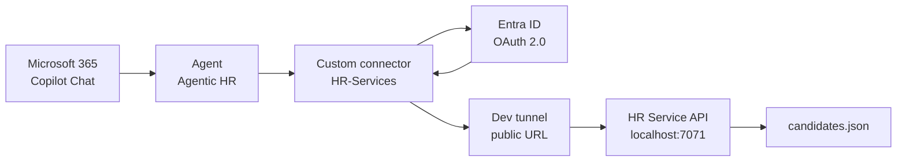

# Lab 4: Call a Secured REST API from an Agent

A connector is how Copilot Studio reaches an API that Microsoft does not ship a connector for. In this lab you take a plain REST API, put it behind a Power Platform custom connector, secure the whole path with Microsoft Entra ID, and let an agent call it on behalf of the signed-in user. The API is a small HR service that manages a list of job candidates.

The point of the lab is not the API. The point is the identity chain: the agent calls the connector, the connector holds an OAuth 2.0 client registration, and the API validates the token it receives. Nothing in that chain uses a shared secret baked into the agent, so every call is traceable to a real user.

**Estimated time:** 45 to 60 minutes

## What you will learn

- How an OpenAPI specification becomes a Power Platform custom connector
- How to register an API and its consumer as two separate Entra ID applications
- Why the consumer app needs a delegated permission on the API app, and what a scope actually buys you
- How to expose a locally running API to the cloud with a dev tunnel
- How to add a custom connector action to an agent and run it with user authentication

## The moving parts



Two Entra ID applications appear in this picture, and mixing them up is the single most common way this lab fails:

- **HR-Service-API** represents the API itself. It *exposes* a scope named `HR.Consume` and it validates incoming tokens.
- **HR-Service-Consumer** represents the custom connector. It *requests* the `HR.Consume` scope and holds the client secret that the connector uses.

An API never holds the secret of its own caller. Keeping the two registrations separate is what makes the token meaningful.

## Prerequisites

- A Microsoft 365 tenant where you can register Entra ID applications
- A Power Platform environment with Copilot Studio (the labs assume an environment named `Copilot Dev Camp`)
- [Visual Studio Code](https://code.visualstudio.com/)
- [REST Client extension](https://marketplace.visualstudio.com/items?itemName=humao.rest-client) for Visual Studio Code
- [Node.js v22 or higher](https://nodejs.org/en) and the [Azure Functions Core Tools](https://learn.microsoft.com/azure/azure-functions/functions-run-local)
- [Dev tunnel CLI](https://learn.microsoft.com/azure/developer/dev-tunnels/get-started)

The API source is already in this repository. You do not need to download anything: use [`./hr-service`](./hr-service/).

> **Provisioning note:** the main path of this lab runs entirely on your machine, so it needs no Azure resources. The hosted shortcut at the end of the lab, and [Lab 5](../lab-5/readme.md), depend on two Azure App Service resources, `food-catalog-api` and `human-resource-mcp`. They must be provisioned before those parts will work. The trainer creates them with [`src/deploy-apis.azcli`](../../../../src/deploy-apis.azcli), which also sets up the storage account, Application Insights, and the SQL connection strings the services read.

---

## Exercise 1: Run the API locally

### Step 1: Start the service

Open [`./hr-service`](./hr-service/) in Visual Studio Code. The parts that matter:

| Path | What it is |
| --- | --- |
| `src/functions/candidatesFunction.ts` | The Azure Function implementing the API |
| `src/data/candidates.json` | The seed list of candidates |
| `src/openapi.json` | The OpenAPI specification you will import into Power Platform |
| `askCandidateData.json` | An Adaptive Card that collects data for a new candidate |
| `http/ht-service.http` | REST Client requests for local testing |
| `local.settings.json.sample` | The configuration template |

Copy the settings template into the file the runtime actually reads, then start the service:

```powershell
cd hr-service
Copy-Item local.settings.json.sample local.settings.json
npm install
npm start
```

The API exposes four operations, all anonymous for now:

| Method | Route | Operation |
| --- | --- | --- |
| `GET` | `/api/candidates` | `getCandidates` |
| `GET` | `/api/candidates/{email}` | `getCandidate` |
| `POST` | `/api/candidates` | `addCandidate` |
| `DELETE` | `/api/candidates/{email}` | `removeCandidate` |

### Step 2: Verify it responds

Open `http/ht-service.http` and select **Send request** above the `GET http://localhost:7071/api/candidates` line. You should get a JSON array of candidates back.

Look at the terminal. Alongside the request trace you will see `OAuth is disabled. Skipping token validation`. That message is the state you are about to change: right now anyone who can reach the URL can read and delete candidate records.

---

## Exercise 2: Secure the API with Entra ID

### Step 1: Register the API application

Go to the [Microsoft Entra admin center](https://entra.microsoft.com), select **App registrations**, then **+ New registration**.

- **Name:** `HR-Service-API`
- **Supported account types:** accounts in this organizational directory only

Register it, then copy the **Application (client) ID** and **Directory (tenant) ID** from the **Overview** page. Write them down; you will need both twice.

### Step 2: Expose a scope

Select **Expose an API**, then **+ Add a scope**. The first time you do this, Entra asks you to accept an **Application ID URI**. Take the default `api://<Client-Id>` and select **Save and continue**.

Now define the scope:

| Field | Value |
| --- | --- |
| Scope name | `HR.Consume` |
| Who can consent? | Admins and users |
| Admin consent display name | `HR.Consume` |
| Admin consent description | `Allows consuming the HR Service` |
| User consent display name | `HR.Consume` |
| User consent description | `Allows consuming the HR Service` |
| State | Enabled |

A scope is a delegated permission: it is the label that appears in the token, and it is what the API checks to decide whether this caller is allowed in. Without it, any token from your tenant would look equally valid.

### Step 3: Ask for v2.0 tokens

Select **Manifest**, switch to the **Microsoft Graph App Manifest (new)** view, and set:

```json
"requestedAccessTokenVersion": 2
```

Save. The sample API validates v2.0 JWTs, so leaving this at the default causes token validation failures that look like generic 401 responses.

### Step 4: Turn on validation in the API

Back in Visual Studio Code, edit `local.settings.json` with the values you copied:

```json
{
  "IsEncrypted": false,
  "Values": {
    "AzureWebJobsStorage": "UseDevelopmentStorage=true",
    "FUNCTIONS_WORKER_RUNTIME": "node",
    "AAD_APP_CLIENT_ID": "<Client-ID>",
    "AAD_APP_TENANT_ID": "<Tenant-ID>",
    "AAD_APP_OAUTH_AUTHORITY": "https://login.microsoftonline.com/<Tenant-ID>",
    "UseOAuth": "true"
  }
}
```

Restart the service. Send the same request from `http/ht-service.http` again: it now returns **401 Unauthorized**, because the REST Client sends no token. That failure is the checkpoint for this exercise.

### Step 5: Register the consumer application

Register a second application, exactly as in Step 1, named `HR-Service-Consumer`. Copy its client ID and tenant ID.

Select **Certificates & secrets**, then **+ New client secret**. Give it a description and an expiry, add it, and copy the **Value** immediately. Entra shows a secret value once and never again.

Select **API permissions**, then **+ Add a permission**, then **APIs my organization uses**. Search for `HR-Service-API`, select it, choose **Delegated permissions**, tick `HR.Consume`, and select **Add permissions**. Finish with **Grant admin consent for \<tenant\>** so users are not prompted individually.

Keep this browser tab open. You come back to it in Exercise 4 with a redirect URL.

---

## Exercise 3: Publish the API with a dev tunnel

Power Platform runs in the cloud and cannot reach `localhost`. A dev tunnel gives your local port a public HTTPS URL for the duration of the lab.

```powershell
devtunnel user login
devtunnel create hr-service -a --host-header unchanged
devtunnel port create hr-service -p 7071
devtunnel host hr-service
```

> If you get `Request not permitted. Unauthorized tunnel creation access`, the tunnel name is taken. Pick a unique one, for example `hr-service-<yourname>`, and use it in all three commands.

Copy the **Connect via browser** URL from the output and keep it. Leave this terminal running for the rest of the lab. If it drops, restart it with `devtunnel host hr-service`; the URL stays the same.

Use `http/ht-service-dev-tunnel.http` to check the tunnel, replacing the host in that file with your own. You should still see 401, now coming through the public URL.

---

## Exercise 4: Build the custom connector

### Step 1: Import the OpenAPI file

Go to [Power Automate](https://make.powerautomate.com) and switch to the `Copilot Dev Camp` environment with the environment picker in the top right corner. Navigate to **More**, **Discover all**, then **Custom connectors**.

Select **+ New custom connector**, then **Import an OpenAPI file**. Name the connector `HR-Services` and browse to `hr-service/src/openapi.json`. Select **Continue**.

> If the import rejects the file, your environment expects Swagger 2.0. Convert the specification with any OpenAPI converter and import the 2.0 result.

### Step 2: Point the connector at the tunnel

On the **General** tab:

- **Host:** the host name of your dev tunnel URL, with no `https://` prefix and no trailing slash, for example `hr-service-abc123.euw.devtunnels.ms`
- **Base URL:** `/`

### Step 3: Configure OAuth 2.0

Select **Security** at the bottom of the page. Choose **OAuth 2.0** as the authentication type and **Azure Active Directory** as the identity provider, then fill in:

| Field | Value |
| --- | --- |
| Client ID | Client ID of **HR-Service-Consumer** |
| Client secret | The secret value from **HR-Service-Consumer** |
| Authorization URL | Leave the default |
| Tenant ID | Your tenant ID |
| Resource URL | `api://<Client-Id-of-HR-Service-API>` |
| Enable on-behalf-of login | False |
| Scope | `HR.Consume` |

The Resource URL is the field people get wrong. It identifies the API being called, so it uses the **API** application's client ID, while every other field on this page belongs to the **consumer** application.

Select **Create connector** in the top right corner.

### Step 4: Close the loop with a redirect URL

After saving, the **Security** tab shows a populated **Redirect URL**. Copy it.

Return to the `HR-Service-Consumer` registration in Entra ID, select **Authentication**, then **+ Add a platform**, then **Web**. Paste the redirect URL and select **Configure**.

This is what lets Entra hand the authorization code back to Power Platform after a user signs in. Without it, the connection attempt in the next step ends in an `AADSTS50011` redirect mismatch error.

### Step 5: Test the connector

Open the **Definition** tab and confirm the four operations imported from the specification. You do not need to change anything here.

Switch to the **Test** tab, select **+ New connection**, and sign in when prompted. Once the connection exists, select the `getCandidates` operation and select **Test operation**.

A 200 response with the candidate list means the full chain works. Check the Visual Studio Code terminal: it now logs `Token is valid for user <username>` instead of the earlier skip message.

---

## Exercise 5: Consume the connector from an agent

### Step 1: Add the action

Open [Copilot Studio](https://copilotstudio.microsoft.com) in the same environment and edit your `Agentic HR` agent from the previous lab. Go to **Tools** (or **Actions**, depending on your release) and select **+ Add a tool**.

Choose the **Custom connector** group, search for `HR-Services`, and select the `Get all candidates` operation. Confirm the connection when asked, then configure:

| Field | Value |
| --- | --- |
| Name | `Get all candidates` |
| Description | `Lists all the HR candidates from an external system` |
| Authentication | User authentication |

Select **Add action**.

The description is not documentation. Generative orchestration reads it to decide whether this action matches the user's intent, so a vague description means the agent will not pick the tool.

If you added an equivalent action in an earlier lab, disable it now: select the three dots next to it and toggle **Status** to `Off`. Two tools that claim to do the same thing make orchestration unpredictable.

### Step 2: Publish and run it

Select **Publish**. Once publishing finishes, open Microsoft 365 Copilot Chat, select the agent, and send:

```text
Lists all the HR candidates from an external system
```

Two prompts appear the first time:

1. A consent prompt to call an external service. Select **Allow once** while you are still testing, or **Always allow** once you trust it.
2. A sign-in prompt, **Sign in to Agentic HR**. Complete it, then send the prompt again.

You get the candidate list, with an indicator in the response showing the data came from an external service. The terminal in Visual Studio Code shows the matching request and the validated user identity.

---

## Checkpoint

You are done when all of the following are true:

- [ ] `GET /api/candidates` returns 401 without a token
- [ ] The custom connector's **Test** tab returns 200 with a connection
- [ ] The terminal logs `Token is valid for user <username>`
- [ ] The agent returns the candidate list in Microsoft 365 Copilot Chat
- [ ] The old duplicate action, if any, is disabled

## Troubleshooting

| Symptom | Cause |
| --- | --- |
| `AADSTS50011` reply URL mismatch | The connector's redirect URL is missing from the consumer app's **Web** platform |
| 401 even with a valid connection | `requestedAccessTokenVersion` is not `2`, or `local.settings.json` holds the wrong client ID |
| Connector test returns 502 or times out | The dev tunnel or the Functions host stopped; restart both |
| The agent answers from its own knowledge and never calls the tool | The action description is too vague, or a duplicate action is still enabled |
| Consent prompt loops | Admin consent was not granted for `HR.Consume` on the consumer app |

## Optional: a hosted API with no local setup

If you cannot run Azure Functions or a dev tunnel, there is a REST API already deployed for this class:

```text
https://food-catalog-api.azurewebsites.net
```

Its OpenAPI specification is at `/swagger/v1/swagger.json`, and the same file is in this repository at [`src/assets/food-api-swagger.json`](../../../../src/assets/food-api-swagger.json). It exposes a Food Inventory catalog:

| Method | Route |
| --- | --- |
| `GET`, `POST`, `PUT` | `/Food` |
| `GET` | `/Food/byname` |
| `GET`, `DELETE` | `/Food/{id}` |

Build a custom connector from it the same way as in Exercise 4, with the host `food-catalog-api.azurewebsites.net`, base URL `/`, and **No authentication** on the **Security** tab. The service is anonymous, so Exercises 2 and 3 do not apply.

You still learn the connector mechanics: OpenAPI import, host configuration, the **Test** tab, and adding the action to an agent. You skip the identity chain, which is the more interesting half of this lab, so use this path only as a fallback or as a warm-up before the secured one.

## Going further

- Import the remaining operations as actions and ask the agent to add or remove a candidate
- Use `askCandidateData.json` to collect new candidate data with an Adaptive Card instead of free-text prompts
- Compare this flow with [Lab 5](../lab-5/readme.md), where an MCP server exposes its tools without an OpenAPI file or a connector definition

## Reference

- [Extend agents with custom connectors](https://microsoft.github.io/copilot-camp/pages/make/copilot-studio/05-connectors/) (the upstream lab, with screenshots for every step)
- [Create a custom connector from an OpenAPI definition](https://learn.microsoft.com/connectors/custom-connectors/define-openapi-definition)
- [Configure a client application to access a web API](https://learn.microsoft.com/entra/identity-platform/quickstart-configure-app-access-web-apis)
