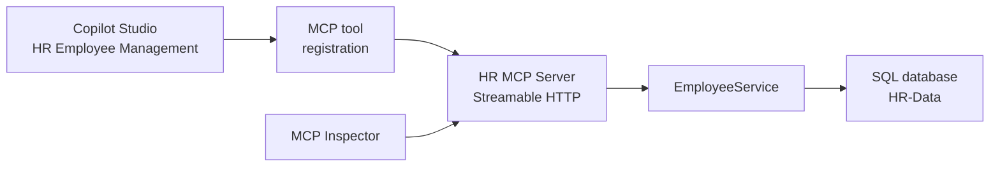

# Lab 5: Give an Agent MCP Tools

In [Lab 4](../lab-4/readme.md) you described an API with OpenAPI, wrapped it in a custom connector, and mapped one operation to one action. This lab does the same job with far less ceremony. You point Copilot Studio at a Model Context Protocol (MCP) server URL, and every tool the server exposes shows up in the agent at once.

That difference is the lesson. A connector is a design-time contract: you import a specification and the tool list is frozen until you re-import it. An MCP server is a runtime contract: the agent asks the server what it can do, so adding a tool on the server side makes it available to the agent without touching the agent.

The server you will use is the HR MCP server from this repository, a .NET 10 application built on the MCP C# SDK. It manages employees in a SQL database and can assign shifts.

**Estimated time:** 30 to 45 minutes

## What you will learn

- What an MCP server exposes and how tool discovery differs from a connector's fixed operation list
- How to inspect a live MCP server with MCP Inspector before wiring it into an agent
- How to register an MCP server as a tool in Copilot Studio and connect to it
- How connections work for MCP tools in the test panel and again in Microsoft 365 Copilot
- How to run and debug the server locally when you want to change its behaviour

## The moving parts



The agent never learns the tool list from you. It calls `tools/list` on the server and gets back the current set, with names, descriptions, and parameter schemas generated from the C# method signatures.

## The tools on offer

| Tool | What it does |
| --- | --- |
| `list_employees` | Returns the whole employee list |
| `search_employees` | Searches by name, email, skills, or current role |
| `add_employee` | Adds an employee with optional languages and skills |
| `update_employee` | Updates an existing employee, matched by email |
| `remove_employee` | Removes an employee by email |
| `assign_shift` | Assigns an employee to an 8 hour shift by name, date, and position |

Each employee carries personal details (first name, last name, email) and professional details (spoken languages, skills, current role).

## Prerequisites

- A Microsoft 365 tenant and a Power Platform environment with Copilot Studio (the labs assume an environment named `Copilot Dev Camp`)
- [Node.js v22 or higher](https://nodejs.org/en) for MCP Inspector
- For the optional local path only: [.NET 10 SDK](https://dotnet.microsoft.com/download), [Visual Studio Code](https://code.visualstudio.com/), and the [dev tunnel CLI](https://learn.microsoft.com/azure/developer/dev-tunnels/get-started)

The server is deployed for this class, so the main path needs no local setup:

```text
https://human-resource-mcp.azurewebsites.net
```

The source is in this repository under [`src/hr-mcp-server`](../../../../src/hr-mcp-server/) if you want to read or change it.

> **Provisioning note:** this lab and [Lab 4](../lab-4/readme.md) depend on two Azure App Service resources, `human-resource-mcp` and `food-catalog-api`. They must be provisioned before the labs will work. The trainer creates them with [`src/deploy-apis.azcli`](../../../../src/deploy-apis.azcli), which also sets up the storage account, Application Insights, and the SQL connection strings the services read. If the URL above does not answer, the resource is not deployed yet: use the local path in the optional exercise at the end of this lab instead.

> The deployed server writes to a shared database. Everyone in the class sees the same employee list, so expect to find other people's additions, and use your own name when you add records.

---

## Exercise 1: Inspect the server

Before handing a server to an agent, look at it yourself. MCP Inspector is the reference client for exactly that.

### Step 1: Launch MCP Inspector

```powershell
npx @modelcontextprotocol/inspector
```

The terminal prints a proxy port and a local URL, and a browser tab opens automatically.

### Step 2: Connect

In the left panel, configure:

- **Transport type:** Streamable HTTP
- **URL:** `https://human-resource-mcp.azurewebsites.net`

Select **Connect**. A green dot and the word **Connected** confirm the session.

Streamable HTTP is the transport Copilot Studio requires. The older stdio transport works only for servers running on the same machine as the client, which is why a cloud service cannot use it.

### Step 3: List and run a tool

In the **Tools** section, select **List Tools**. All six tools appear, each with the description and parameter schema derived from `Tools/HRTools.cs`.

Select `list_employees`, then **Run tool**. A green **Success** message and a JSON employee collection come back.

Now select `search_employees`, enter a `searchTerm` such as `Alice`, and run it. The **History** section keeps every request and response, which is the fastest way to see what the agent will send later.

> **Checkpoint:** six tools listed, `list_employees` returning data. If the connection fails here, it will fail in Copilot Studio too, so fix it before moving on.

---

## Exercise 2: Create the agent

### Step 1: Create it

Open [Copilot Studio](https://copilotstudio.microsoft.com), switch to your `Copilot Dev Camp` environment, and select **Create an agent**.

- **Name:**

```text
HR Employee Management
```

- **Description:**

```text
An AI assistant that helps manage HR employees using MCP server integration
for comprehensive employee management
```

- **Instructions:**

```text
You are a helpful HR assistant that specializes in employee management. You can help users search
for employees, get detailed employee information, add new employees to the system, and assign
employees to shifts.
Always provide clear and helpful information about employees, including their skills, spoken
languages, current role, and contact details.
When assigning a shift, confirm the employee name, the date, and the position back to the user.
```

- **Model:** GPT-5 Chat

Select **Create**, then **Publish**.

Notice what the instructions do not contain: any mention of tool names. Orchestration matches intent against the tool descriptions the server publishes, so the instructions set behaviour and tone while the server supplies capability.

### Step 2: Add suggested prompts

On the **Overview** page, fill in **Suggested prompts**:

| Title | Prompt |
| --- | --- |
| List all employees | `List all the employees` |
| Search employees | `Search for employees with name [NAME_TO_SEARCH]` |
| Add new employee | `Add an employee with firstname [FIRSTNAME], lastname [LASTNAME], e-mail [EMAIL], role [ROLE], spoken languages [LANGUAGES], and skills [SKILLS]` |
| Assign a shift | `Assign [NAME] to the [POSITION] shift on [DATE]` |

Select **Save**.

---

## Exercise 3: Wire the MCP server into the agent

### Step 1: Register the server as a tool

In your agent, go to **Tools** and select **+ Add a tool**.

Choose the **Model Context Protocol** group. This lists the MCP servers already available in the environment. Select **+ New tool**, then **Model Context Protocol** in the dialog that follows.

Configure the server:

| Field | Value |
| --- | --- |
| Name | `HR MCP Server` |
| Description | `Allows managing the list of employees and their shifts for the HR department` |
| URL | `https://human-resource-mcp.azurewebsites.net` |
| Authentication | None |

Select **Create**.

Authentication is `None` because this server is open for the class. In production you would put Entra ID in front of it, which is the same identity problem you solved in Lab 4, applied to MCP instead of a connector.

### Step 2: Connect

Copilot Studio creates the tool and then asks for a connection, showing **Not connected**. Select that status, then **Create a new connection**, and follow the prompts.

Registering a server and connecting to it are two separate acts. The registration is a definition in the environment; the connection is per user, and this is why you connect again later in Microsoft 365 Copilot.

Once connected, select **Add and configure**. The details page lists all six tools now available to the agent.

### Step 3: Test in the agent

Select **Publish**, then use the test panel:

```text
List all employees
```

If Copilot Studio asks you to **Open connection manager**, connect there and select **Retry**. You then get the employee list, produced by the `list_employees` tool.

Try a tool that takes arguments:

```text
Add an employee with firstname John, lastname Smith, email john.smith@contoso.com,
role Software Engineer, spoken languages English and Spanish, skills React and Node.js
```

The agent extracts each argument from your sentence and calls `add_employee`. Confirm with `List all employees` and find the new record at the end.

Now exercise the tool that has no equivalent in the connector lab:

```text
Assign John Smith to the bar shift on 2026-08-03 starting at 10
```

Other prompts worth trying:

```text
Update the employee with email john.smith@contoso.com to speak also French
```

```text
Search for employees with skill Project Management
```

```text
Remove employee john.smith@contoso.com
```

---

## Exercise 4: Publish to Microsoft 365 Copilot

Select **Channels**, then **Teams and Microsoft 365 Copilot**. Tick **Make agent available in Microsoft 365 Copilot**, select **Add channel**, close the panel, and select **Publish** again.

Reopen the channel and select **See agent in Microsoft 365**, then **Add** and **Open**.

Run a prompt such as:

```text
Search for employee Alice
```

You are prompted to open the connection manager again. That is expected: the connection you created in the maker portal belongs to that context, and Microsoft 365 Copilot is a different one. Connect, retry, and the agent answers with the matching employee.

---

## Optional: Run the server locally

Do this when you want to change the tools, add breakpoints, or work offline.

### Step 1: Start it

```powershell
cd src/hr-mcp-server
dotnet run
```

The server listens on `http://localhost:47002`. Opening that URL in a browser returns a JSON error, which is correct: the endpoint speaks MCP, not HTML, so any response at all proves it is up.

Connect MCP Inspector to the local instance with the bundled configuration:

```powershell
npx @modelcontextprotocol/inspector --config inspector.config.json --server hr-mcp
```

### Step 2: Expose it with a dev tunnel

Copilot Studio runs in the cloud and cannot reach `localhost`:

```powershell
devtunnel user login
devtunnel create hr-mcp -a --host-header unchanged
devtunnel port create hr-mcp -p 47002
devtunnel host hr-mcp
```

> If you get `Request not permitted. Unauthorized tunnel creation access`, the name is taken. Use a unique one such as `hr-mcp-<yourname>` in all three commands.

Copy the **Connect via browser** URL, open it once in a browser, and select **Continue** on the confirmation page. Use that URL as the MCP server URL in Exercise 3, and leave both the tunnel and `dotnet run` going.

### Step 3: Debug a tool

Set a breakpoint in `Tools/HRTools.cs` and attach the Visual Studio Code debugger. Prompt the agent, and execution stops inside the tool with the arguments the model extracted from natural language. Watching those values arrive is the clearest way to understand what orchestration actually sends.

Adding a method with `[McpServerTool]` and a `[Description]` is all it takes to add a capability. Restart the server, reconnect, and the agent discovers it. Compare that with re-importing an OpenAPI file and re-adding an action.

---

## Checkpoint

- [ ] MCP Inspector lists six tools and `list_employees` returns data
- [ ] The `HR MCP Server` tool is registered in the agent with a live connection
- [ ] The agent lists employees in the test panel
- [ ] The agent adds an employee from a single natural-language prompt
- [ ] The agent assigns a shift
- [ ] The agent answers in Microsoft 365 Copilot after connecting there

## Troubleshooting

| Symptom | Cause |
| --- | --- |
| Inspector cannot connect | Wrong transport; it must be Streamable HTTP, not SSE or stdio |
| Copilot Studio rejects the URL | A trailing slash or a path was appended; use the bare server URL |
| The agent replies but never calls a tool | The agent was not published after adding the tool, or the connection is missing |
| `Open connection manager` appears repeatedly | You connected in a different context; each channel needs its own connection |
| Local server unreachable through the tunnel | The dev tunnel confirmation page was never accepted in a browser |
| Employee list contains unfamiliar records | Expected on the shared deployment; everyone writes to the same database |

## Connector or MCP server

| | Custom connector (Lab 4) | MCP server (Lab 5) |
| --- | --- | --- |
| Contract | OpenAPI file imported at design time | Discovered at runtime via `tools/list` |
| Adding a capability | Re-import the specification, re-add the action | Add a method, restart the server |
| Per-action configuration | Name, description, and authentication per action | Inherited from the server's tool metadata |
| Authentication | OAuth 2.0 wired into the connector | Configured on the server registration |
| Best for | Existing REST APIs and stable contracts | Tool sets that evolve, and reuse across AI clients |

MCP is not a replacement for connectors. It suits capability sets that change often and that you want to reuse across several AI clients, since the same server also works with Claude, VS Code, and any other MCP host.

## Reference

- [Consuming an MCP server](https://microsoft.github.io/copilot-camp/pages/make/copilot-studio/06-mcp/) (the upstream lab, with screenshots for every step)
- [Extend your agent with Model Context Protocol](https://learn.microsoft.com/microsoft-copilot-studio/agent-extend-action-mcp)
- [Model Context Protocol specification](https://modelcontextprotocol.io/)
- [MCP for beginners](https://github.com/microsoft/mcp-for-beginners)
